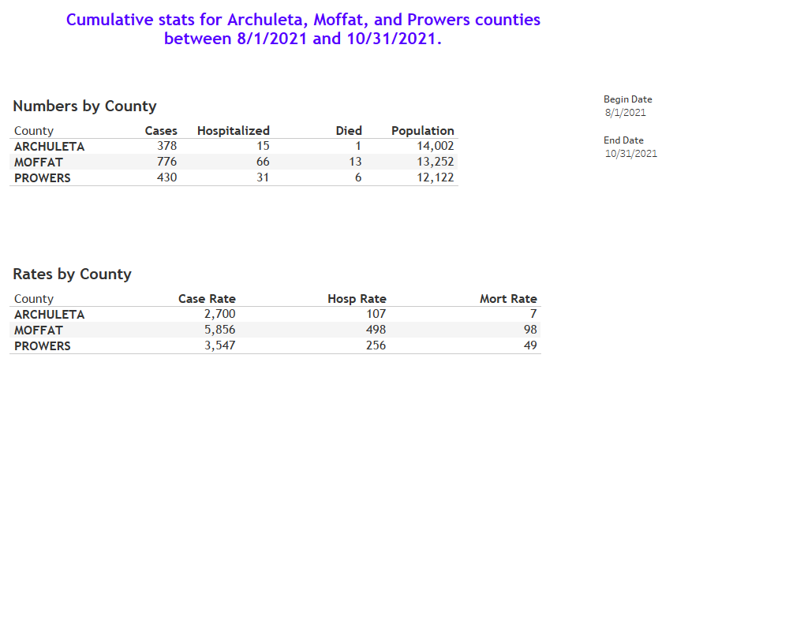

## Background 
This data request came thru Eduardo. The first request was for the death rate in Moffat county and how it compares to Colorado as a whole. Later, they also asked for hospitalization rate in Moffat county and how that compared to all of Colorado. 

**Population**:  Confirmed and probable cases in CEDRS with `Outcome='Patient Died'` (Deaths) per 100K population.  **Groups**: Moffat county and all Colorado counties. Data was asked for two time periods: all dates and since June 1, 2021.  **Data requested**: Case rate per 100K by county for all time and FY20-21 sorted in descending order. 

## Response
Final response was delivered snippet of SAS output placed in chat to Eduardo.

#

## Code
The SAS program used to generate the response was [RFI.Cases_by_County.sas](RFI.Cases_by_County.sas). This may also require running [Access.Population](../Access.Populations.sas) to obtain COVID. Population data if not already available.
#

**Issues:**
* I wasn't available to respond to second data request for Moffat county which was for the outcome hospitalization rates. 

## Follow-up request
On 11/15/21 a [request](Documents/Email_request_111521.pdf) came in for an update to hospital and mortality rates for Moffat county for the period August 1st - October 31st, 2021. Rates for similar sized counties were added to the request - Archuleta and Prowers. 

The following SAS programs were used to respond to this request:
|SAS program|Purpose|
|-----------|-------|
|1. [Access.CEDRS_view.sas](../0.Universal/SAS%20code/Access.CEDRS_view.sas)|Access SQL data table on dphe144 and curate data|
|2. [Fix.CEDRS_view.sas](../0.Universal/SAS%20code/Fix.CEDRS_view.sas)|Edit data per data validation checks|
|3. [Get.County_rates.sas](../Get.County_rates.sas)|This program calculates case rate, hosp rate, COPHS rate, and mortality rate and the 7-day moving average of these four rates. |
||This program has two parts. The first part generates these rates for all of Colorado. This SAS code served as a template for "County_rate.macro.sas".|
||The second part of this program calls this macro and runs it for all 64 counties. The county level datasets are mashed together and merged with the Colorado rate dataset. The final dataset is placed in the DASH folder where it is read by Tableau.
|4. [Macro.CountyRates.sas](../0.Universal/SAS%20code/Macro.CountyRates.sas)|Defines macro for calculating case rate and rates for hosp, COPHS, and mortality.|

## Response II
Emailed the dashboard image below to Eduardo and Alicia on 11/16/21.

