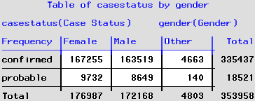

## Background 
On October 5, 2021 Rachel Herlihy received an [email](./Documents/Email_request.pdf) CDC requesting aggregated data to be included in the National Notifiable Diseases Surveillance System (NNDSS). On October 12, 2021 Eduardo asked me to respond to this data request. The CDC email contained an [Excel spreadsheet template](./Documents/Worksheet_2020_Aggregate_COVID-19_Data.xlsx) with instructions. 

**Population**:  Confirmed and probable cases reported to CEDRS for Colorado residents during the 12 "MMWR" months of 2020.  **Groups**: Case status (confirmed and probable) by MMWR Month, Age Group, Sex, and Race and Ethnicity combined.  **Data requested**: Aggregated case counts for confirmed and probable cases. 

## Code
In preparation for aggregating the data, I checked the data, particularly the grouping variables, using [Check.Aggregate_Counts_NNDSS.sas](SAS/Check.Aggregate_Counts_NNDSS.sas). The SAS program [RFI.Aggregate_Counts_NNDSS.sas](SAS/RFI.Aggregate_Counts_NNDSS.sas) was used complete the tables in the Excel spreadsheet template. 

The dataset to be aggregated comes from CEDRS_View with following filters applied:
* Case Status is 'confirmed' or 'probable'
* Reported Date is between 12/19/19 and 1/2/21
* County is NOT = "INTERNATIONAL"

Total observations in filtered dataset = 353,960

Here is the table of total aggregated cases by Case Status:

##
Here is the table of total aggregated cases by MMWR month:

##
Here is the table of total aggregated cases by age:

##
Here is the table of total aggregated cases by gender:

The table of aggregated cases by Race and Ethnicity are not shown here but can be found, with all of the aggregated data, in the completed [template](./Documents/Worksheet_2020_Aggregate_COVID-19_Data.xlsx).

## Response
Final aggregated case counts have been placed in [Excel spreadsheet template](./Documents/Worksheet_2020_Aggregate_COVID-19_Data.xlsx) provided by CDC.
#

**Issues:**
* CDC NNDSS has specific date requirements based on MMWR weeks. MMWR week 1 of 2020 is from Sunday, December 29, 2019 to Saturday, January 4, 2020. The SAS date format WEEKU is supposed to define weeks of the year based on Sunday being the first day. However, when I checked the ReportedDate values with WEEKU format it didin't seem to align with MMWR week defined by CDC. Therefore, I used the following code to create a MMWR week number linked to ReportedDate.

##
Code for creating MMWR Week for 2020:

 

This code links the calculated MMWR week value with each reported date.
