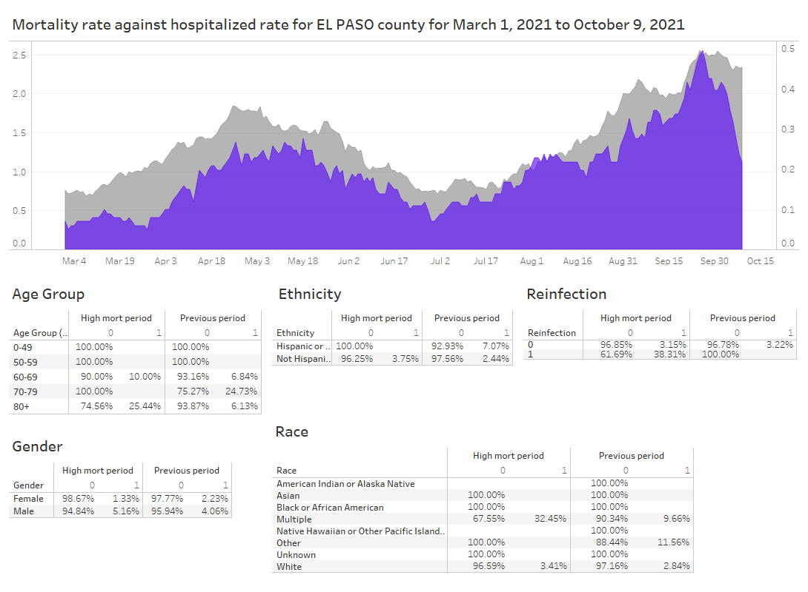

## Background 
This data request came from Ginger Stringer thru Alicia. Memorial Hospital reported to EPCPH that they have had the largest number of COVID deaths in a week, ever. Asked us to look at recent deaths for that facility and determine if there is a particular population impacted, e.g. incarcerated, homeless. 

**Population**:  Confirmed and probable cases in CEDRS with `Outcome='Patient Died'` (Deaths) per 100K population.  **Groups**: El Paso county for "high mortality period" defined as July 1, 2021 - present. Present defined as October 9, 2021 due to lag in surveillance system.  **Data requested**: Outcome variable used was 14 day moving average of "patient died" rate. Evaluated several independent variables such as Age Group, Gender, Ethnicity, Race, etc. 

## Code
Started writing a SAS program [RFI.Memorial_Hosp_mortality_rates.sas](SAS/RFI.Memorial_Hosp_mortality_rates.sas) to use to respond to this data request, however, I wasn't getting anywhere with it.
Second approach was to deploy [Get.County_rates.sas](../Get.County_rates.sas) for El Paso county. This program calls [Macro.CountyRates.sas](../0.Universal/SAS%20code/Macro.CountyRates.sas). I modified the macro to add mortality rate and calculate 14 day moving averages.

The macro creates a SAS dataset with rates and rolling averages. Tableau was used to connect to this data, idenity the 'high mortality period', and explore relationships between 14 day moving average for mortality rate and selected variables. 

**NOW that I think about it though, this was NOT a valid approach. SAS dataset collapses patient-level CEDRS dataset into a DATE-level dataset to calculate daily rates by group-processing and keeping last observation in group (ReportedDate). Thus, any patient-level data, such as age, is from the last obs in the group only.**

## Response
That's a bummer because I built a beautiful dashboard with highlighted findings.

For what it's worth - here is the dashboard:
#

#
**Issues:**
* I wasn't available to respond to second data request for Moffat county which was for the outcome hospitalization rates. 

