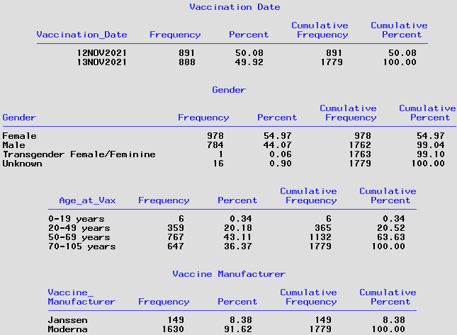

## Background 
This data request came from Montrose Vaccine clinic via Alicia Cronquist. Alicia's [email](./Documents/Email_request_120321.pdf) was forwarded to me from Eduardo. 

On November 30th Heather Roth sent Lindsey Webb an email with a line list of 1779 individuals vaccinated at Montrose county vaccine clinic on November 12-13, 2021. Lindsey asked Breanna and Alicia if they could have someone look to see if any of these 1779 patients were cases in CEDRS. 

**Population**: First population consisted of 1,779 individuals vaccinated at Montrose vaccine clinic on November 12-13, 2021. Population #2:  Confirmed and probable cases in CEDRS.  **Data requested**: Intersection of the two populations.   **Groups**: Gender, Age, Date vaccinated, and Vaccine manufacturer. 


## Code
Here are the SAS programs used to respond to this data request:

|Run order|SAS program|
|---------|-----------|
|1.|Access.COPHS pulls data from hosp144 COPHS and curates it.|
|2.|FIX.COPHS edits data in COPHS.|
|3.|RFI.Montrose_VB.sas creates dataset from Montrose spreadsheet and of individuals on that list that were in CEDRS.|

Sections of the RFI.HH_transmission.sas code

### **1. Import spreadsheet and curate data from Montrose Vaccine clinic**

Patient_Name field has format Last,First (#). Code in this section parses patient name into last name, then first name, then in 'extra' field to hold numeric id, stripped of parentheses.
Use DOB column to create birthdate var with format YYYY-MM-DD which is consistent with format of DOB in CEDRS66.Profiles. Create new calculated variable "Age at Vaccination". Finally, create KEY variable based on Birthdate:Last name:First name format for match merging to CEDRS cases.

The variable names and their attributes for the Montrose vaccine clinic line listing are [here](./Documents/PROC_Contents.Montrose_Fix.pdf). 


### **2. Link ProfileID and KEY variablbe (DOB:LAST:FIRST) and filter on CEDRS cases**


NOTES for CEDRS66.Profiles dataset:
* CEDRS66.Profiles has ProfileID AND DOB, Last Name, First name
* DOB, Last Name, First name are the components to the KEY variable
* DOB needs to be a character format and not a SAS date var
* KEY variable has length $85 and ProfileID has length $15
* ==>  Profiles_Key dataset

NOTES for CEDRS_view dataset:
* COVID.CEDRS_view_fix has ProfileID for all cases
* Filter out cases not assigned to a Colorado county
* Keep selected variables from CEDRS
* ==>  CEDRS dataset

NOTES for merged dataset of Profiles and CEDRS:
* SORT Profiles_Key and save as Profiles_sort
* SORT CEDRS and save as CEDRS_sort
* Merge Profiles_sort and CEDRS_sort on ProfileID.
* KEEP only records only from CEDRS 
* ==>  CEDRS_key  dataset

NOTES for merged dataset of Montrose and CEDRS:
* SORT Montrose_fix and save as Montrose_DOB
* SORT CEDRS_key and save as CEDRS_DOB
* Merge Montrose_DOB and CEDRS_DOB on KEY variablbe (DOB:LAST:FIRST).
* KEEP records from both Montrose list and CEDRS 
* ==>  Montrose_cases  dataset

Here is the link to the variable names and their attributes for the [Montrose_cases](./Documents/PROC_Contents.Montrose_Cases.pdf) dataset.

##
### **3. Characteristics of line listing:**
##
There were 1,779 individuals vaccinated on November 12 and 13. The number vaccinated each day was nearly equal. The majority vaccinated were female (55%) and received Moderna (92%). About 80% were 50 plus years old.



##
### **4. Analysis of Montrose cases**
##
The 159 vaccinated individuals that have records in CEDRS can be found here: [Montrose_cases.csv](Output%20data/Montrose_cases.csv). 

The vast majority of these 159 individuals were reported as cases prior to November 1, 2021. Here is the number of cases by month reported to CEDRS:


The 16 records where `ReportedDate > 11/01/21` are excluded. The [CEDRS_Addresses](Documents/PROC%20contents.CEDRS_Addresses.pdf) dataset contains 178,093 cases.


Findings:
````diff
+/*------------------------------------------------------------------------------------------*
+ |FINDINGS:
+ | There are several examples of HH's with slightly different values for Address1
+ |    For example:
+*--------------------------------------------------------------------------------------------*/
````
These are only a few examples of the types of data issues with Address1. At this time, these data issues have been ignored. For the majority of the cases though, it was deemed that Address1, in the context of County and City, was a sufficient tool for defining HH.

The CEDRS_Addresses data was thus grouped based on County, City, and Address1 to create "Households". HH with only a sigle case were excluded.

**Here is the distribution of cases per HH:**


It was decided to exclude HH with more than ten cases. Thus, eligible HH were those that had 2-10 cases per HH. There was a total of 61,309 cases in the 24,519 eligible HH.

### **5. Defining Clusters** 

Cases within a HH were grouped based on how they clustered in time. So a case that was reported within 30 days of the previous case was considered to be part of the same "cluster". There were a total of 30,988 clusters with the eligible HH.

**Here is the distribution of clusters per HH:**


###  **6. Creating an analysis variable**
Over a quarter of the HH had two clusters of cases, i.e. cases that were more than 30 days apart. Nearly three quarters had only a single cluster of cases.  The data request was to look at the proportion of clusters that began with the various age groups.   

|Abbrev.|Label|Age range|
|---------|-----|------------|
|i or I|infants|0-4 year olds|
|k or K|kids|5-11 year olds|
|t or T|teens|12-17 year olds|
|a or A|adults|18-15 year olds|

Thus, each cluster has a variable, `AG`, which displays the cases by Age Group in the order in which they were reported. For HH cases in Fall 2020, the AG variable is all lower case letters. Whereas for Fall 2021, the AG variable is all upper case letters. 

**Here is an exerpt of the HH data:**


#
The list of variables and their attributes for the final dataset is [HERE](Documents/PROC%20contents.HHcases.pdf).


## Response
Response was shared with Eduardo and Alicia via Google Slides:

https://docs.google.com/presentation/d/12aJxnbAFpz1XrXOR8NyD1DXJisqfUAT8gyXR-TKEWiQ/edit?usp=sharing


#
**Issues:**
# Oh! Where do I begin??!! 
* Definition of a HH? Single family homes only? Should we exclude apartment complexes? If not, is each apartment a separate HH or should the entire apartment complex be a single HH?
* Almost 3000 cases were missing data for State. Many of these could be CO households. Most of these have Zipcode data. If Zipcode data was cleaned and converted to numeric, it could easily be used to impute State=CO when Zipcode was 80000-80700.
* Zipcode data needs to be cleaned.

