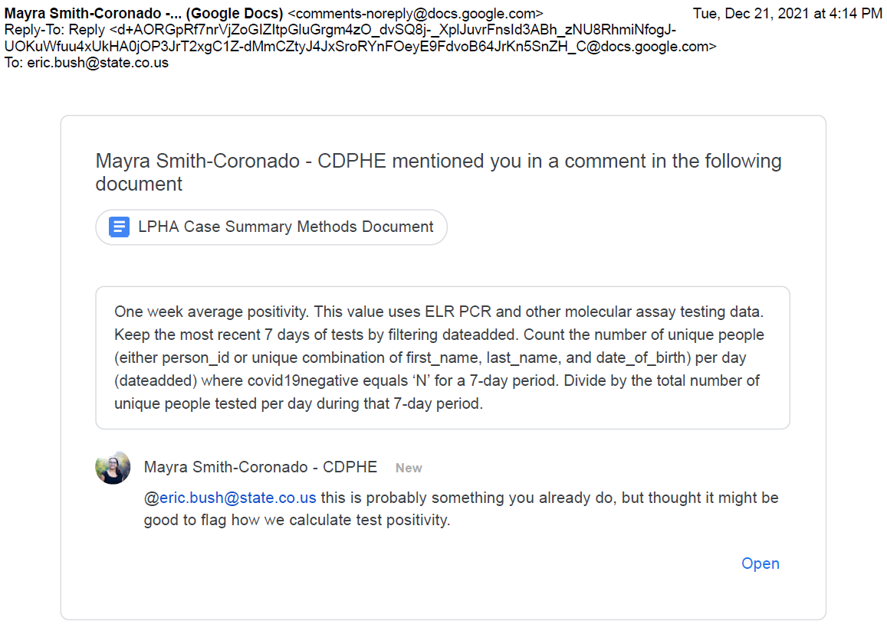

## Background 
With the rapid onset of Omicron variant, case investigations are lagging and therefore CEDRS is not able to provide the most recent stats of this new wave. Therefore, Alicia shared a [brainstorming document](../23.ELR%20dashboard/Documents/Doc_ELR%20epi%20questions_122221.pdf) on how we can make use of ELR data. 

The epi questions assigned to data team were:
* Epi curve for Colorado.
 
**Population**:  ELR laboratory results where `ResultDate> 11/1/21` and `COVID19Negative=NO`.   **Data requested**: Epi curve based on daily count of new cases. Number of new cases is the daily number of distinct patients where `COVID19Negative=NO`. Date variable used was `DateAdded`. (Cf. Issue #1)  **Groups**: Epi curve by Colorado county and all-hazards regions. 

## Documentation
From Mayra - Here is how they calculate test positivity:

## Code
The source data was the `covid19_elr_full_dataset_constrained` data table in the TESTS schema on the dphe144 server. Tableau was used to directly connect to the Microsoft SQL server. So no SAS programs were used to respond to this data request.

### ELR_Full is the Tableau workbook used to explore the source data.
|Field|Comments|
|-----|--------|
|`Test Type`|Several variations of "PCR". These were grouped into single value of "RT-PCR". Test type of "Other Molecular Assays" was excluded at data source.|
|`Lab`|Lab has two values: CDPHE and non-CDPHE. Both are included in this analysis|
|`Result`|>100 different response categories. These were grouped but practically speaking the only responses needed are "POSITIVE" and "NEGATIVE"|
|`Covid19Negative`|Yes/No indicator variable. >9000 discordant values when compared to `Result` variable|
|`ResultDate`|This has about 100 records with bad date values, i.e. <2020 with a mode at 1900 for missing DOB and a mode at 2012, probably transpose error at data entry.|
|`DateAdded`|Another contender. No missing or poor date values. This is the field to be used for epi curves.|
|`CollectionDate`|Not much of a contender. Defeated by lots of poor quality date values with >2300 records with dates <2020. |

There were also a few tabs to used to prepare epidemic curve. The request was for daily case counts. For such a short time window, i.e. last several weeks, the lab reporting trend was more prominent than secular trend.

It made more sense to me to display a 7 day moving average of new daily cases as this would wash out the lab reporting trend and better display the secular trend. For the Colorado epi curve, both outcome measures were used. For the county-level and Region-level epi curves, just the 7 day moving average was used.

### Test_Positivity is a Tableau workbook.
This is a workbook I had used before to look at daily test positivity trends with overlay of 7 day moving average. This workbook  was connected to the `covid19_positivity_trends` table in the TESTS schema on the dphe144 server. This data table is used to generate numbers posted on the CDPHE website. My chart was able to match these numbers.

Various attempts were made to duplicate these numbers using the ELR_Full data. However, I was never able to do so. Comparison of different estimates are summarized in the Excel spreadsheet [Test_Positivity_comparison](Documents/Test_Positivity_comparison.xlsx).

### ELR_Omicron is the Tableau workbook used to generate final charts.

Here is a summary of the sheets and dashboards in ELR_Omicron workbook.

|Tab title|Tab type|Comments|
|---------|--------|--------|
|Outcome by Date added|Sheet|Epi curve using `DateAdded` field. Selector parameter for outcome measure of Case Count or 7 day moving average.|
|Outcome by Result Date|Sheet|Epi curve using `ResultDate` field. Selector parameter for outcome measure of Case Count or 7 day moving average.|
|County Outcome by Date added|Sheet|Epi curve using `DateAdded` field. Selector parameter for outcome measure of Case Count or 7 day moving average. Filter for `County` added.|
|Colorado Region Map|Sheet|Colorado map displaying County regions with cumuative case count per region|
|Region Outcome by Date added|Sheet|Epi curve using `DateAdded` field. Selector parameter for outcome measure of Case Count or 7 day moving average. Filter for `County (group)` added, i.e. region. Use this sheet to generate chart image exported to response slide. Shade goes from dark to light as move from West to East. Colors go from green to red as you move from North to South.|
|ELR Region filter|Dashboard|Displays region map to be used as filter for epi curve.|
|Northern Regions|Sheet|Displays stacked bar chart of epi curves for Northern tier regions.|
|Southern Regions|Sheet|Displays stacked bar chart of epi curves for Southern tier regions.|
|Central Regions|Sheet|Displays stacked bar chart of epi curves for Central tier regions.|
|Single Region epicurve|Sheet|Displays epi curves for filtered region.|

The last four sheets were used to generate epi curve which was then copied (view) and pasted to Google slides. The color legend was copied independently so that it would show on the slide as an appropriate size.

The next day the following sheets were added to the workbook:
|Tab title|Tab type|Comments|
|---------|--------|--------|
|Gender chart|Sheet|Epi curve (Daily 7d average) by Gender.|
|Gender box plot|Sheet|Box plot for distribution of all 7d moving averages over entire period|
|Gender box plot by week|Sheet|Same box plot but by week.| 
|Gender box plot first six weeks|Sheet|Same box plot but by month for the first six weeks (which have similar distritbution).| 
|Gender box plot by last two weeks|Sheet|Same box plot but by week for the last two weeks of December. Shows changed in gender distribution.| 

**NOTE**: The last two sheets require resetting the begin and end dates appropriately to produce the expected charts, i.e. charts put into final slides.

### ELR_Omicron_Age is the Tableau workbook used to generate pediatric line charts.

|Tab title|Tab type|Comments|
|---------|--------|--------|
|Test type|Sheet|Confirms total number of PCR tests.|
|Age pop|Sheet|Displays distinct count of patients by Age group. Age groups are similar to previous requests for pediatric epi curves.|
|Age Case Counts|Sheet|Distinct count of patients that were NOT covid negative, by age group.|
|Case rates|Sheet|Calcualted variable of ratio of Case counts to 100K population by age group.|
|Case rate lines by age|Sheet|Epi curves based on case rates by age group.|
|Case rate 7d avg by age|Sheet|Epi curves based on 7d moving average of case rates by age group.|
|Pct Tests pos by Age|Sheet|Bar chart of percent of PCR tests that were positive by age.|

**NOTE**: The worksheets using case rates blend the county population data by age group with the ELR_Full data. County name and Age group are used to blend the data.

## Response
Four slides were created. One slide for the overall epi curve for Colorado for each of the two outcome measures. A third slide for comparing the three tiers of counties/regions. The last slide displays the epi curve for the eight individual regions.

Two additional slides were added the next day. One for gender and one for age groups.

Here is the link to the Google slide file [ELR dashboard slides](Documents/ELR%20dashboard%20slides.pdf).  

##
**Issues:**

* **Outcome variable selection**. There is a `Result` field but it contains a hundred different response categories, i.e. very messy. The vast majority of results however are "Postive" or "Negative". Another outcome variable is `COVID19Negative`. There are >9000 discordant records in the 2x2 of these two outcome variables. RS indicated this was a known issue and that the best outcome variable to use is `COVID19Negative`. 
  
* Was not able to get daily percent positive to match calculated values of Test Positivity from official data table.

* Still need to create epi curves for Colorado by Age and Gender.

