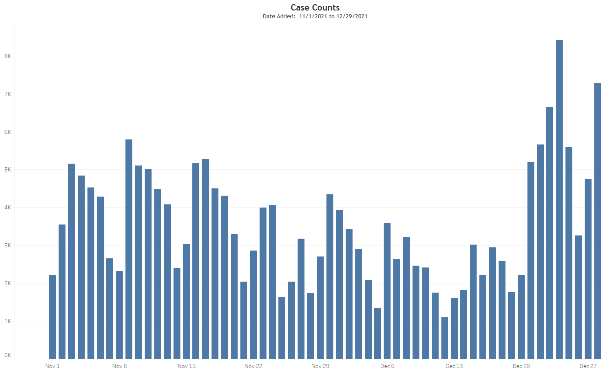
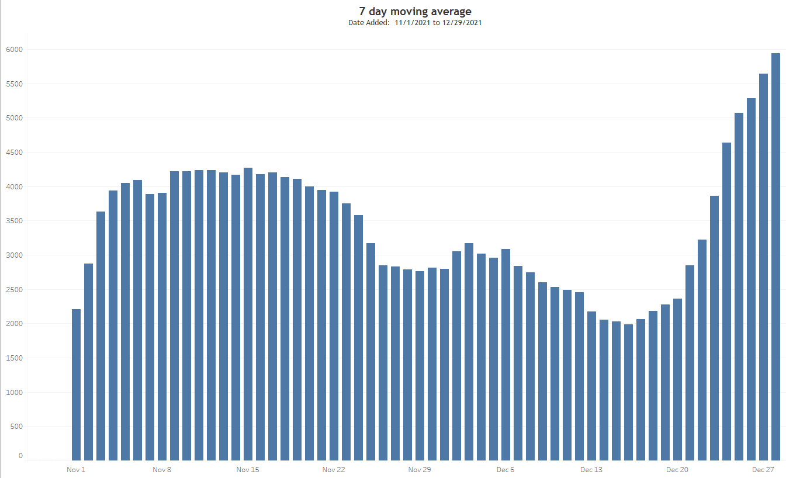

## Background 
With the rapid onset of Omicron variant, case investigations are lagging and therefore CEDRS is not able to provide the most recent stats of this new wave. Therefore, Alicia shared a [brainstorming document](../23.ELR%20dashboard/Documents/Doc_ELR%20epi%20questions_122221.pdf) on how we can make use of ELR data. 

The epi questions assigned to data team were:
* Epi curve for Colorado.
 
**Population**:  ELR laboratory results where `ResultDate> 11/1/21` and `COVID19Negative=NO`.   **Data requested**: Epi curve based on daily count of new cases. Number of new cases is the daily number of distinct patients where `COVID19Negative=NO`. Date variable used was `DateAdded`. (Cf. Issue #1)  **Groups**: Epi curve by Colorado county and all-hazards regions. 

## Code
The source data was the `covid19_elr_full_dataset_constrained` data table in the TESTS schema on the dphe144 server. Tableau was used to directly connect to the Microsoft SQL server. So no SAS programs were used to respond to this data request.

### ELR_Full is the Tableau workbook used to explore the source data.
|Field|Comments|
|-----|--------|
|`Test Type`|Several variations of "PCR". These were grouped into single value of "RT-PCR"|
|`Lab`|Lab has two values: CDPHE and non-CDPHE. Both are included in this analysis|
|`Result`|>100 different response categories. These were grouped but practically speaking the only responses needed are "POSITIVE" and "NEGATIVE"|
|`Covid19Negative`|Yes/No indicator variable. >9000 discordant values when compared to `Result` variable|
|`ResultDate`|This has about 100 records with bad date values, i.e. <2020 with a mode at 1900 for missing DOB and a mode at 2012, probably transpose error at data entry.|
|`DateAdded`|Another contender. No missing or poor date values. This is the field to be used for epi curves.|
|`CollectionDate`|Not much of a contender. Defeated by lots of poor quality date values with >2300 records with dates <2020. |

There were also a few tabs to used to prepare epidemic curve. The request was for daily case counts. For such a short time window, i.e. last several weeks, the lab reporting trend was more prominent than secular trend.

It made more sense to me to display a 7 day moving average of new daily cases as this would wash out the lab reporting trend and better display the secular trend. For the Colorado epi curve, both outcome measures were used. For the county-level and Region-level epi curves, just the 7 day moving average was used.

### Test_Positivity is a Tableau workbook.
This is a workbook I had used before to look at daily test positivity trends with overlay of 7 day moving average. This workbook  was connected to the `covid19_positivity_trends` table in the TESTS schema on the dphe144 server. This data table is used to generate numbers posted on the CDPHE website. My chart was able to match these numbers.

Various attempts were made to duplicate these numbers using the ELR_Full data. However, I was never able to do so. Comparison of different estimates are summarized in the Excel spreadsheet [Test_Positivity_comparison](Documents/Test_Positivity_comparison.xlsx).

### ELR_Omicron is the Tableau workbook used to generate final charts.

Here is a summary of the sheets and dashboards in this workbook.

|Tab title|Tab type|Comments|
|---------|--------|--------|
|Outcome by Date added|Sheet|Epi curve using `DateAdded` field. Selector parameter for outcome measure of Case Count or 7 day moving average.|
|Outcome by Result Date|Sheet|Epi curve using `ResultDate` field. Selector parameter for outcome measure of Case Count or 7 day moving average.|
|County Outcome by Date added|Sheet|Epi curve using `DateAdded` field. Selector parameter for outcome measure of Case Count or 7 day moving average. Filter for `County` added.|
|Colorado Region Map|Sheet|Colorado map displaying County regions with cumuative case count per region|
|Region Outcome by Date added|Sheet|Epi curve using `DateAdded` field. Selector parameter for outcome measure of Case Count or 7 day moving average. Filter for `County (group)` added, i.e. region. Use this sheet to generate chart image exported to response slide. Shade goes from dark to light as move from West to East. Colors go from green to red as you move from North to South.|
|ELR Region filter|Dashboard|Displays region map to be used as filter for epi curve.|
|Northern Regions|Sheet|Displays stacked bar chart of epi curves for Northern tier regions.|

## Response
Two SAS datasets were created and exported to Excel. One for HH's with >10 cases and the most recent case had value of `LiveinInstitution='YES'` and another tab for HH's with >10 cases and the most recent case had value of `LiveinInstitution NOT ='YES'`.  Here is the link to the Excel file: [HighRiskHH](./Output%20data/HighRiskHH.xlsx).  

##
**Issues:**

* **Outcome variable selection**. There is a `Result` field but it contains a hundred different response categories, i.e. very messy. The vast majority of results however are "Postive" or "Negative". Another outcome variable is `COVID19Negative`. There are >9000 discordant records in the 2x2 of these two outcome variables. RS indicated this was a known issue and that the best outcome variable to use is `COVID19Negative`. 
* 
* NOTE for example the first record where Address1='5400 SHERIDAN BLVD'. If print out all records with this address it can be noted there are three different cities. Not sure if this is the same physical location or not.
* NOTE for example that the second record where Address1='5400 SHERIDAN BOULEVARD' is most likely the same physical location as the first record but is defined here as a distinct HH. This issue occurs quite commonly. So the number of cases per HH is a minimum and not an accurate count. 

