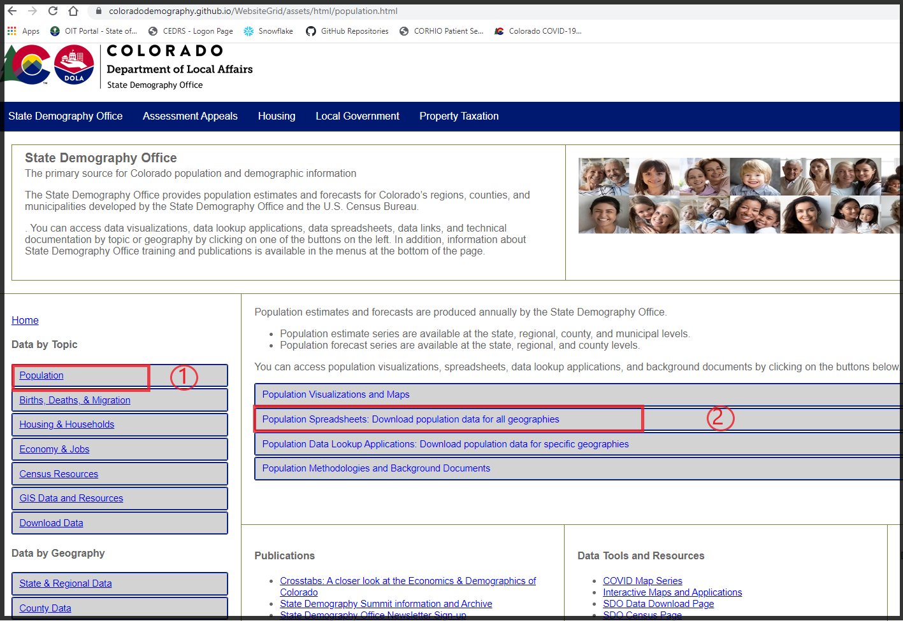
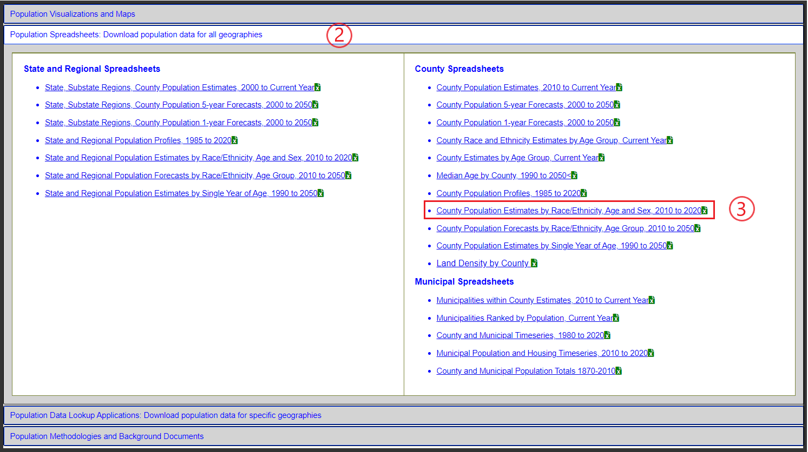
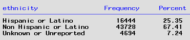

## Background 
Rachel Herily requested, via Alicia Cronquist, a slide of daily hospitalizations per 100,000 by Race - Ethnicity. The email forwarded to me from Eduardo is [here](Documents/Email_request_021822.pdf).

**Population**:  COPHS hospitalization data for Colorado residents.   **Data requested**: 7 day moving average of the hospitalization rate (new hosp admits per 100,000) for COVID cases hospitalized between October 1, 2020 and the present (February 7, 2022 to account for two week lag). **Groups**: Race and Ethnicity. These two variables were combined to be in alignment with the demographic population data:
* Hispanic orgin (all races)
* White (Non-Hispanic origin)
* Black (Non-Hispanic origin)
* Asian/Pacific Islander (Non-Hispanic origin)
* American Indian (Non-Hispanic origin)


## Code
Here are the SAS programs used to respond to this data request:

|Run order|SAS program|
|---------|-----------|
|1.|[Access.COPHS](../0.Universal/SAS%20code/Access.COPHS.sas) pulls data from dbo144 Hosp.COPHS_tidy and curates it.|
|2.|[Check.COPHS](../0.Universal/SAS%20code/Check.COPHS.sas) checks COPHS data quality.|
|3.|[FIX.COPHS](../0.Universal/SAS%20code/Fix.COPHS.sas) edits COPHS data.|
|4.|[GET.CO_Population_Race.sas](./SAS/GET.CO_Population_Race.sas) downloads data from Colorado's State Demography Office to obtain 2020 population counts by County, Age, Race, and Ethnicity.|
|5.|[RFI.Hosp_rates_Race.sas](./SAS/RFI.Hosp_rates_Race.sas) to prep COPHS data for use in Tableau and to generate basic counts of cases and population by single Race-Ethnicity categories.

The GET.CO_Population_Race.sas obtains data accessed at this website:
https://coloradodemography.github.io/WebsiteGrid/assets/html/population.html

Here are the steps to navigate to the data source:

1. Data by Topic:  Population
2. Population Spreadsheets: Download population datga for all geographies




3. County Population Estimates by Race/Ethnicity, Age and Sex, 2010 to 2020




Then the following steps were taken to process the downloaded demographic data:
1. download csv. Default filename is "race-estimates-county.csv" 
2. open CSV file, delete ID column, Rename Tab to DATA --> then save as Excel file
3. Save as Excel file file in INPUT folder

The SAS dataset County_Race_POP2020 is created via this section of code:
````diff
+DATA County_Race_POP2020; length Race_Ethnicity $ 22 ;  set mysheets.DATA;
+   where year=2020;
+   rename sex=Gender;
+   rename count=Population;
+
+* create single Race - Ethnicity variable *;
+   if Ethnicity = 'Hispanic Origin' then Race_Ethnicity='Hispanic Origin';
+   else Race_Ethnicity=Race;
+run;
````
##
Here is the 2020 population count by single Race-Ethnicity:
##


Since the SDO County population data uses County FIPS codes only, another temp dataset that links County FIPS codes with County names was used to join with County_Race_POP2020. The final SAS dataset is stored permanently in my Tableau dashboard directory:  DASH.County_Population


### RFI.Hosp_rates_Race.sas.
The COPHS_fix dataset is filtered by `Hosp_Admission` where dates are between 01OCT2020 and 01DEC2022 per request and to exclude invalid date values. The indicator variable for Colorado residents was modified in the COPHS.fix code and used to filter data to only Colorado residents. Only selected variables are retained.

Here is the distribution of hospitalizations by Ethnicity:


**NOTE: In the creation of a single Race-Ethnicity variable, Race for those that are not Hispanic or Latino was based on race for Non-Hispanics and also those with unknown or unreported Ethnicity.**

##
Here is the 2020 case count, based on hospital admissions, by single Race-Ethnicity:
##


The final SAS dataset is stored permanently in my Tableau dashboard directory:  DASH.COPHS_fix

## Hospitalization rates (7d) by Race/Ethnicity is the Tableau workbook used to generate final charts

The workbook connects to the two data sources described above, i.e.:
1. County_Population
2. COPHS_fix

Here is a summary of the sheets and dashboards in Hospitalization rates (7d) by Race/Ethnicity workbook.

|Tab title|Tab type|Description|
|---------|--------|-----------|
|Population|Sheet|;alskdjf|
|Cases|Sheet|l;kj|
|Case rates|Sheet|lkj
|Case rate calc|Sheet|lkjdf|
|Case rate by month|Sheet|lkj
|Case rate 7d plot|Sheet|
|Case rate 30d plot|Sheet|
|HospRate|Dashboard|
|HospRate_w_Denom|Dashboard|


 are workbook has two worksheets for the Ethnicity viz - a bar chart and a stacked bar chart. The bar chart worksheet was duplicated as a crosstab to generate the data table. There is also a worksheet for the Race viz and it's corresponding data table.

A copy of the workbook has been placed on the J: drive in this directory: J:\Programs\Other Pathogens or Responses\2019-nCoV\Tableau

## Response
I copied images of the two Ethnicity charts, the one Race chart, and the two data tables in the Google doc. Here is the link to the Google file [Jan24Response](https://docs.google.com/document/d/1Lqd1g-cuRHGaXNH4M19b8MaWCwmI1ue9H2m0DCzFQBU/edit#heading=h.vo6r01jlzrtw).  


##
**Issues:**

* None so far. Oh, except that I'm doing the 'analyze and run' thing.


