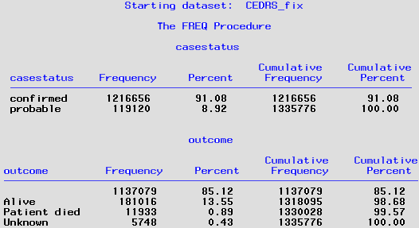
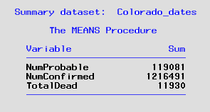

## Background 
CDC scrapes the CDPHE website daily to capture Colorado case counts. It calculates the differences each day to determine new cases. However, CDPHE dashboard for COVID-19 reflects not only the diseaes dynamics in the Colorado population but also workload constraints and integration issues. Thus, when the CDPHE dashboard is updated with a large bolus of cases, it appears to CDC as a spike in case counts. So, for example, recently Colorado has been erronously identified as a national hotspot. To amend this situation, we have been asked to report historical case counts to CDC weekly.

Some of the background regarding this request is part of a lengthy email [chain](../28/../28.CDC%20case%20counts/Documents/CDC_Historical_Case_Count_RFI_032122.pdf) between CDPHE and the CDC Aggregate Data team. The original request came in March 14, 2022. I was tasked with it on March 21, 2022.  The email contains the specific data elements requested. 

**Population**:  Confirmed and probable cases in CEDRS by ReportedDate. Include cases unallocated to a county, i.e. `CountyAssigned="INTERNATIONAL"` **Groups**: Case status (confirmed and probable) and Outcome (Patient died) for all of Colorado and by Colorado county.  **Data requested**: Daily count of confirmed, probable, and total cases. Daily count of deaths for confirmed and probable cases, and total deaths. For each of these outcomes a cumulative daily total was calcualted. Daily change in cumulative totals was calcuated for total cases and total deaths. 

The CDC Aggregate Data team provided a [template](./Documents/Bulk_Historical_Update_Template.xlsx) as before. This is to capture Colorado level numbers. I don't think there is a template for County level numbers.

## Code
Here are the SAS programs used to respond to this data request:

|Run order|SAS program|
|---------|-----------|
|1.|[Access.CEDRS_view](../0.Universal/SAS%20code/Access.CEDRS_view.sas) pulls data from dbo144 COVID19 and curates it.|
|2.|[FIX.CEDRS_view](../0.Universal/SAS%20code/Fix.CEDRS_view.sas) edits data pulled from CEDRS.|
|3.|[RFI.CDC_Case_counts_COLORADO.sas](./SAS/RFI.CDC_Case_counts_COLORADO.sas) to generate requested filters CEDRS data to population defined above.|
|4.|[RFI.CDC_Case_counts_COUNTY.sas](./SAS/RFI.CDC_Case_counts_COLORADO.sas) to generate requested filters CEDRS data to population defined above.|

The RFI.CDC_Case_counts_COLORADO.sas program is based on [RFI.Historical_case_counts.sas](../12.Historical case counts by status/RFI.Historical_case_counts.sas). It creates a "timeline" - a SAS dataset that contains every date value from 3/1/20 to present.

An unfiltered copy of CEDRS_view_fix is made and `CountyAssigned = "INTERNATIONAL"` is changed to `CountyAssigned = "UNALLOCATED"` as this is how CDC displays case counts for patients where assigned county is out-of-State. The only variables kept are ReportedDate, County, case status, and outcome.

The patient-level dataset is reduced to a single record per day. Each record contains accumulated number of cases and deaths by case status, i.e. confirmed, probable. 

The dataset of daily counts are merged to the Timeline dataset so that every day of the pandemic is represented. For days with no cases or deaths, accumulator variables are backfilled with zeros. New variables for totals across case status are calculated. The extra days from the Timeline dataset, which had values going to 3/31/22 resulted in obs with missing county values. These records were deleted.

After this section, a table of case counts before and after the data manipulation is created as a check.

**From CEDRS_fix data:**

**From historical daily summary data:**

The Colorado_dates dataset that contains daily totals for cases and deaths by status is read again date and cummulative totals are added to the dataset and daily changes are calculated. Labels are defined to match the 12 column headers in the template spreadsheet.

#
## Findings
For this first weekly submission of historical counts, the total counts by status for cases and deaths was:

#

## Response
Final output from SAS was saved as a CSV file:  [Colorado Historical Data](Colorado_Historical_data.csv) CDC provided a template for recieving historical data. I re-ordered the columns in the CSV file to match their template and then copied the column headers. I saved the modifed csv file as and Excel file named [Bulk Historical Update Colorado](Bulk_Historical_Update_Colorado.xlsx). This was emailed to Sarah of the Aggregate Data team at CDC on September 24, 2021.

#

## Code
#### The SAS program used to generate the response was [RFI.Historical_case_counts.sas](RFI.Historical_case_counts.sas). 
To update this response, the following would need to be done:
1. Modify the section of SAS code that creates a timeline, i.e. continuous unbroken list of ReportedDate's from January 1, 2020 to present. Specifically, increase the number of iterations that the DO loop runs.

2. Follow steps to create an updated version of COVID.CEDRS_view_fix dataset to pull the latest data on reported COVID cases in Colorado.

The final dataset was exported to create the CSV file for the responding to this data request. The code generated by the export wizard was [Export.COHxData.sas](Export.COHxData.sas)
#
**Issues:**
* Nothing yet. 

