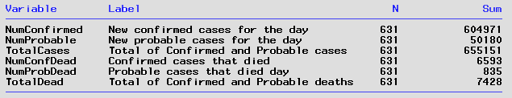

## Background 
This data request came from CDC Aggregate Data team for historical data in order to reconcile Colorado COVID cases and deaths in their aggregate dataset. Here is the [email](./CDC_email.pdf). The original request came in August 3, 2021. I was tasked with it on September 22, 2021.  The email contains the specific data elements requested. 

**Population**:  Confirmed and probable cases in CEDRS by ReportedDate. **Groups**: Case status (confirmed and probable) and Outcome (Patient died).  **Data requested**: Daily count of confirmed, probable, and total cases. Daily count of deaths for confirmed and probable cases, and total deaths. For each of these outcomes a cumulative daily total was calcualted. Daily change in cumulative totals was calcuated for total cases and total deaths. 

#
## Findings
At the time of this response, here are the calculated totals for the requested data:

The N=631 is the number of days between January 1, 2020 and September 22, 2021. 
#

## Response
Final output from SAS was saved as a CSV file:  [Colorado Historical Data](Colorado_Historical_data.csv) CDC provided a template for recieving historical data. I re-ordered the columns in the CSV file to match their template and then copied the column headers. I saved the modifed csv file as and Excel file named [Bulk Historical Update Colorado](Bulk_Historical_Update_Colorado.xlsx). This was emailed to Sarah of the Aggregate Data team at CDC on September 24, 2021.

#

## Code
#### The SAS program used to generate the response was [RFI.Historical_case_counts.sas](RFI.Historical_case_counts.sas). 
To update this response, the following would need to be done:
1. Modify the section of SAS code that creates a timeline, i.e. continuous unbroken list of ReportedDate's from January 1, 2020 to present. Specifically, increase the number of iterations that the DO loop runs.

2. Follow steps to create an updated version of COVID.CEDRS_view_fix dataset to pull the latest data on reported COVID cases in Colorado.

The final dataset was exported to create the CSV file for the responding to this data request. The code generated by the export wizard was [Export.COHxData.sas](Export.COHxData.sas)
#
**Issues:**
* Nothing yet. 

