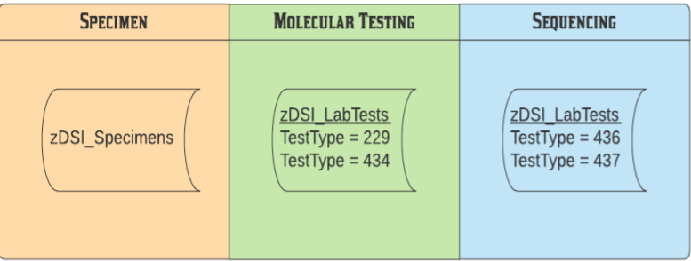
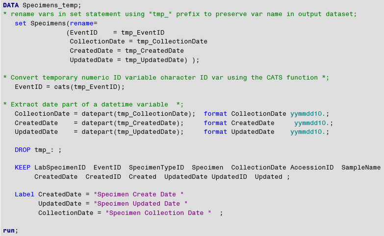
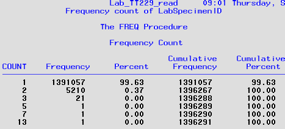
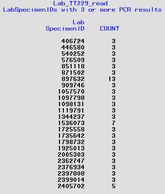
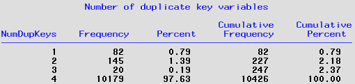
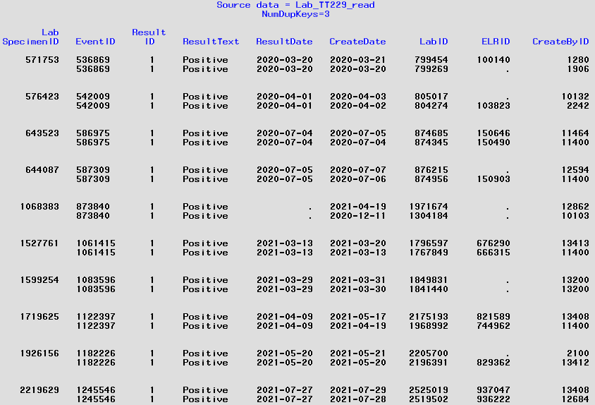
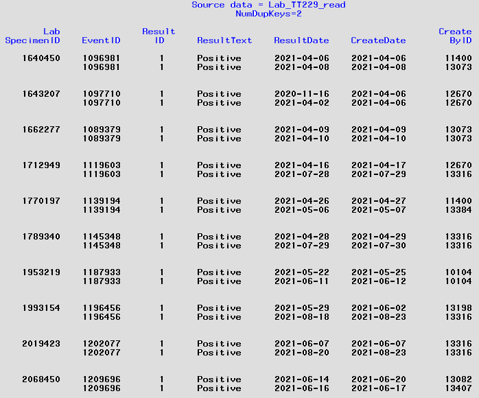
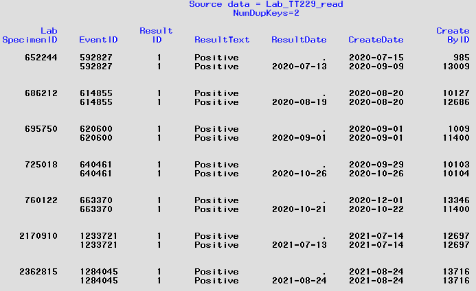
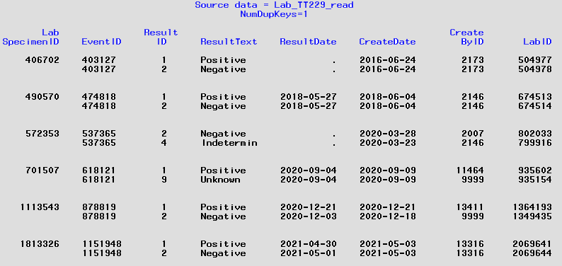

# Data-request for Specimens that have been sequenced 
## Background:
This request is for the proportion of specimens collected from confirmed and probable COVID cases.  **Population**:  Confirmed and probable cases with specimen create date or collection date from January 1, 2021 to present that have a positive PCR or other molecular assay result.  **Outcomes**: percent of positive specimens that have been sequenced.  **Groups**: Week of collection date (or create date) and type of laboratory that provided sequencing results, i.e. CDPHE lab or other lab.  

#

## Data sources:
Diagnostic testing is sequential and begins with specimen collection. The vast majority of specimens are tested for COVID using RT-PCR. Some are tested using other molecular assays. Those with positive test results are eligible for whole genome sequencing. Sequenced results include SARS2 variant type and "VOC" indicator (variant of concern). 

#### Source data tables:


The five source data tables were read and curated using a separate "Access.*.sas" program for each.
 * [Access.Specimens.sas](../Access.Specimens.sas)            
 * [Access.Lab_TT229.sas](../Access.LabTests_TT229.sas) - fiters LabTests on TestTypeID=229
 * [Access.Lab_TT434.sas](../Access.LabTests_TT434.sas) - fiters LabTests on TestTypeID=434        
 * [Access.Lab_TT436.sas](../Access.LabTests_TT436.sas) - fiters LabTests on TestTypeID=436
 * [Access.Lab_TT437.sas](../Access.LabTests_TT437.sas) - fiters LabTests on TestTypeID=437

These programs are nearly identical. They change SQL columns with date values into SAS date variables, convert EventID from numeric to character variable, and keep selected variables. The dataset is passed through a "shrink" macro to reduce the length of the character variables to the minimum size possible.



###
The five `Access.*.sas` programs result is the following curated SAS datasets.
###
#### Curated data tables:

###
## Data cleaning:

**1. Check.Specimens_read.sas**

This program conducts data checks on selected variables in Specimens_read. The "_Collection_Date_" variable in this dataset stores the date the specimen was collected. The full list of variables and their attributes for the Specimens_read dataset are listed [HERE](./contents/PROC_Contents.Specimens_read.pdf).

````diff
+/*-----------------------------------------------------------------*
+| Check Specimens_read data for:
+|  1. Evaluate "CreatedID" and "Created" variables
+|  2. Evaluate "UpdatedID" and "Updated" variables
+|  3. Evaluate "SpecimenTypeID" and "Specimen" variables
+|  4. Examine records with duplicate LabSpecimenID's
+|  5. Evaluate date variables
+*-----------------------------------------------------------------*/
````
Some of the findings from this program include:

````diff
For check 1:
+| "CreatedID" is the numeric code assigned to names
+| "Created" holds the names.
+| Over 60% of Specimens were created by "System Admin" (38%) or ELRAutoImport (23%).

For check 2:
+| "UpdatedID" is the numeric code assigned to names. There are multiple names assigned to each code.
+| However, all names assigned to a code have the same first name but different last name.
+| "Updated" holds the names.

For check 3:
+| SpecimenTypeID is a two digit numeric code assigned to Specimen types. 
+| Specimen describes the Specimen type.

For check 4:
+| LabSpecimenID is a numeric ID that can be 1 to 7 digits long. 
+| There are NO duplicate LabSpecimenID 's in this dataset.

For check 5: 
+| CreatedDate has no missing values. 
+| UpdatedDate exists for approx 1.5% of Specimens.
+| Collection date is missing in < 1% of Specimens.  
+| All date values are from much earlier time period than COVID. 
+| CollectionDate goes from 1900 to 2106, i.e. there are some wrong values.
+| CreatedDate goes from 1999 to present.
+| UpdatedDate goes from 2017 to present.

````

##
**2. Check Lab_TT229_read**

This program conducts data checks on selected variables in Lab_TT229_read dataset. This datsaset has the results for ALL RT-PCR tests run on specimens collected. The full list of variables and their attributes for the Lab_TT229_read dataset are listed [HERE](./contents/PROC_Contents.Lab_TT229_read.pdf).

````diff
+/*------------------------------------------------------------------------------*
+| Check Lab_TT229_read data for:
+| 1. Compare "CreateBY" and "CreatedBY" variables
+| 2. Evaluate "ResultID" and "ResultText" variables
+| 3. Examine records with duplicate LabSpecimenID's
+|    a) Records with duplicate LabSpecimenID that have > 2 LabTest results 
+|    b) Records with duplicate LabSpecimenID that have 2 LabTest results
+| 4. Evaluate date variables
+*------------------------------------------------------------------------------*/
````

Some of the findings from this program include:

````diff
For check 1:
+| CreateBYID has no missing responses
+| CreateDbyID only has 3900 responses, most are missing.
+| ** DO NOT USE CreateDbyID. DROP this variable.

For check 2:
+| ResultID is the numeric code assigned to ResultText. 
+| ResultText holds the description of the RT_PCR result.
     ResultID=1 for ResultText = 'Positive'
     ResultID=2 for ResultText = 'Negative'
     ResultID=4 for ResultText = 'Indeterminate'
     ResultID=9 for ResultText = 'Unknown'
     ResultID=99 for ResultText = 'Result is Text'
+| QuantitativeResult variable is nearly useless given wide range of responses.

Check 3 - see below

For check 4:
+| CreateDate has no missing values. 
+| UpdateDate exists for approx 0.3% of PCR results.
+| Result date is missing for approx 2.0% of PCR results.  
+| All date values are from much earlier time period than COVID, i.e. 1920.
+| ResultDate has values several months into the future, i.e. Dec 2021
+| CreateDate goes from 2013 to present. 
+| UpdateDate goes from 2017 to present. 

````

Check 3 is to examine records with multiple LabSpecimenID's. The following table shows the frequency distribution of records by number of records, i.e. RT-PCR tests, per specimen.



At the time this data check was run there were 1,396,291 unique values of LabSpecimenID (LSI). There were 24 LSI that had 3 or more records, i.e. PCR results. Here is the list:



Since none of the PCR results for these LSI's have sequence results, i.e. they are not found on Lab_TT437, they were deleted in the cleaned dataset.

For the 5000+ duplicate records, i.e. LSI with two PCR tests, the observations were grouped by the number of key variables containing identical values. The key variables evaluated were `LabSpecimenID`, `ResultID`, `ResultDate`, and `CreateDate`. Here is that distribution:



**Number of Dup Keys = 4:** Over 95% of duplicates were identical on all four key variables. In these cases the first record was kept.

**Number of Dup Keys = 3:** There were 10 duplicate LSI which had identical values for `LabSpecimenID`, `ResultID`, `ResultDate` but had different values for `CreateDate`. Here are the records:



It can be seen that seven of them have a `CreateDate` that differs by a single day. The others differ by months. Since the duplicates have the same result, the record with the earliest `CreateDate` was kept and the other one dropped.

**Number of Dup Keys = 2:** There were many more LSI with duplicate records that only had identical values for  `LabSpecimenID`, `ResultID` but different `ResultDate` and  `CreateDate`. In many cases they had the same `CreatedID` value, i.e. the record was created by the same person. Here are some of the records with two different values for `ResultDate`:



These records were de-duplicated as above, i.e. keep record with latest result date and earliest create date. The other group of duplicates that differed on `ResultDate` were in cases where the `ResultDate = .` Here are some example records:



These records were deduplicated by deleting the record where `ResultDate = .`.

**Number of Dup Keys = 1:** The final group of duplicates were those that only had one key variable with identical results. These records had different results for the same LSI. As with the previous group of duplicates, some of these had one record with a missing result and the other record had a result. In these cases the record with the missing result was deleted. 

The others had two different results, e.g. `ResultText = Positive` for one record and for the duplicate record (on LSI) `ResultText = Negative`. Here are some examples:



For these duplicates, the record with the lowest value of ResultID was kept, e.g. `ResultID=1` was kept and `ResultID=2` was deleted. 


###
## Data editing:


###
## Data merging:


|     | <p align="left">Steps taken to get data for revised table</p> |
| --- | ------------------------------------------------------------------------------------ |
|1| Access.Specimens.sas program reads and curates data from dphe66 zDSI_LabTests.Specimen. |
| | This is a specimen-level dataset that includes every type of specimen for any reportable disease |


|2| *Access.Lab_TT229* reads and curates data from dphe6 zDSI_LabTests and filters on TestTypeID=229, which is for 'RT-PCR' tests. |
|3| Run Access.zDSI_Events to get Age. Creates zDSI_Events.read|
|4| Run FIX.zDSI_Events to create Age_in_Years variable|
|5| Run FIX.CEDRS_view to edit data in CEDRS_view_read, add Age_in_Years variable.  Creates CEDRS_view_fix
|9| Run Access.COPHS to acquire data from hosp144 COPHS. Creates COPHS_read  |
|10| Use Check.COPHS for data checks. Output informs edits made in Fix.COPHS|
|11| Run FIX.COPHS to edit data in COPHS_read.  Creates COPHS_fix
|12| Run RFI.MMWR_NFTF_Table3.sas to generate numbers for results table.  
|   | It makes use of the output from these SAS programs that get automatically run:
        1) MMWR.formats to create user-defined formats to recategorize data
        2) Key_merge.COPHS.CEDRS to merge COPHS data with CEDRS data

```
 What does this look like?
```

  *does*

## SAS Programs in this folder:

| Program name    | Input Dataset  | Output Dataset   | Purpose                                  
| --------------- | -------------- | ---------------- | ---------------------------------------| 
|RFI.MMWR_NFTF_Table1|CEDRS_view_fix; B6172_fix; COPHS_fix|MMWR_Cases & MMWR_ICU|Generate numbers for **first** data request table
|RFI.MMWR_NFTF_Table2|CEDRS_view_fix; B6172_fix; COPHS_fix|MMWR_Cases & MMWR_ICU|Generate numbers for **second** data request table
|RFI.MMWR_NFTF_Table3|CEDRS_view_fix; B6172_fix; COPHS_fix|MMWR_Cases & MMWR_ICU|Generate numbers for **third** data request table
|MMWR_formats| *N/A* | *N/A* |Create user defined formats
|Key_merge.COPHS.CEDRS|dbo66.Profiles; & COVID.COPHS_fix; & MMWR_cases|MMWR_ICU|Merge ICU data from COPHS into MMWR_Cases
|Delta_Story.sas| COVID.CEDRS_view; COVID.B6172_fix; COVID.County_Population | MMWR_cases | free lance code for telling story of delta emergence during third COVID wave in CO |
|Vx data merge|Sheet from Rachel with CIIS data attached||Merge vaccination data to CEDRS data
||
|**RETIRED PROGRAMS:** | |
| OLD_Check.CEDRS_view| CEDRS_view_fix; B6172_fix; COPHS_fix| *N/A*|Run data checks on CEDRS view|
|RFI.MMWR_NFTF_Table1|CEDRS_view_fix; B6172_fix; COPHS_fix|MMWR_Cases & MMWR_ICU|Generate numbers for **first** data request table
|RFI.MMWR_NFTF_Table2|CEDRS_view_fix; B6172_fix; COPHS_fix|MMWR_Cases & MMWR_ICU|Generate numbers for **second** data request table


