# Data-request for Specimens that have been sequenced 
## Background:
This request is for the proportion of specimens collected from confirmed and probable COVID cases.  **Population**:  Confirmed and probable cases with specimen create date or collection date from January 1, 2021 to present that have a positive PCR or other molecular assay result.  **Outcomes**: percent of positive specimens that have been sequenced.  **Groups**: Week of collection date (or create date) and type of laboratory that provided sequencing results, i.e. CDPHE lab or other lab.  

###
## Data sources:
Diagnostic testing is sequential and begins with specimen collection. The vast majority of specimens are tested for COVID using RT-PCR. Some are tested using other molecular assays. Those with positive test results are eligible for whole genome sequencing. Sequenced results include SARS2 variant type and "VOC" indicator (variant of concern). 

#### Source data tables:
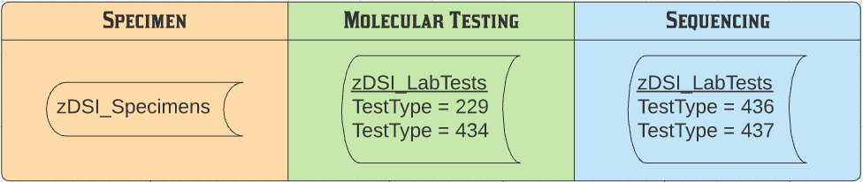


The five source data tables were read and curated using a separate "Access.*.sas" program for each.
 * [Access.Specimens.sas](../Access.Specimens.sas)            
 * [Access.Lab_TT229.sas](../Access.LabTests_TT229.sas) - fiters LabTests on TestTypeID=229
 * [Access.Lab_TT434.sas](../Access.LabTests_TT434.sas) - fiters LabTests on TestTypeID=434        
 * [Access.Lab_TT436.sas](../Access.LabTests_TT436.sas) - fiters LabTests on TestTypeID=436
 * [Access.Lab_TT437.sas](../Access.LabTests_TT437.sas) - fiters LabTests on TestTypeID=437

These programs are nearly identical. They change SQL columns with date values into SAS date variables, convert EventID from numeric to character variable, and keep selected variables. The dataset is passed through a "shrink" macro to reduce the length of the character variables to the minimum size possible.


###
The five `Access.*.sas` programs result is the following curated SAS datasets.
###
#### Curated data tables:
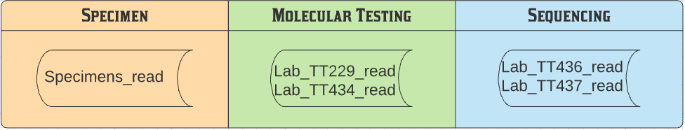
###
## Data cleaning:

**1. Check.Specimens_read.sas**

This program conducts data checks on selected variables in Specimens_read. The "_Collection_Date_" variable in this dataset stores the date the specimen was collected. The full list of variables and their attributes for the Specimens_read dataset are listed [HERE](./contents/PROC_Contents.Specimens_read.pdf).

````diff
+/*-----------------------------------------------------------------*
+| Check Specimens_read data for:
+|  1. Evaluate "CreatedID" and "Created" variables
+|  2. Evaluate "UpdatedID" and "Updated" variables
+|  3. Evaluate "SpecimenTypeID" and "Specimen" variables
+|  4. Examine records with duplicate LabSpecimenID's
+|  5. Evaluate date variables
+*-----------------------------------------------------------------*/
````
Some of the findings from this program include:

````diff
For check 1:
+| "CreatedID" is the numeric code assigned to names
+| "Created" holds the names.
+| Over 60% of Specimens were created by "System Admin" (38%) or ELRAutoImport (23%).

For check 2:
+| "UpdatedID" is the numeric code assigned to names. There are multiple names assigned to each code.
+| However, all names assigned to a code have the same first name but different last name.
+| "Updated" holds the names.

For check 3:
+| SpecimenTypeID is a two digit numeric code assigned to Specimen types. 
+| Specimen describes the Specimen type.

For check 4:
+| LabSpecimenID is a numeric ID that can be 1 to 7 digits long. 
+| There are NO duplicate LabSpecimenID 's in this dataset.

For check 5: 
+| CreatedDate has no missing values. 
+| UpdatedDate exists for approx 1.5% of Specimens.
+| Collection date is missing in < 1% of Specimens.  
+| All date values are from much earlier time period than COVID. 
+| CollectionDate goes from 1900 to 2106, i.e. there are some wrong values.
+| CreatedDate goes from 1999 to present.
+| UpdatedDate goes from 2017 to present.

````

##
**2. Check Lab_TT229_read**

This program conducts data checks on selected variables in Lab_TT229_read dataset. This datsaset has the results for ALL RT-PCR tests run on specimens collected. The full list of variables and their attributes for the Lab_TT229_read dataset are listed [HERE](./contents/PROC_Contents.Lab_TT229_read.pdf).

````diff
+/*------------------------------------------------------------------------------*
+| Check Lab_TT229_read data for:
+| 1. Compare "CreateBY" and "CreatedBY" variables
+| 2. Evaluate "ResultID" and "ResultText" variables
+| 3. Examine records with duplicate LabSpecimenID's
+|    a) Records with duplicate LabSpecimenID that have > 2 LabTest results 
+|    b) Records with duplicate LabSpecimenID that have 2 LabTest results
+| 4. Evaluate date variables
+*------------------------------------------------------------------------------*/
````

Some of the findings from this program include:

````diff
For check 1:
+| CreateBYID has no missing responses
+| CreateDbyID only has 3900 responses, most are missing.
+| ** DO NOT USE CreateDbyID. DROP this variable.

For check 2:
+| ResultID is the numeric code assigned to ResultText. 
+| ResultText holds the description of the RT_PCR result.
     ResultID=1 for ResultText = 'Positive'
     ResultID=2 for ResultText = 'Negative'
     ResultID=4 for ResultText = 'Indeterminate'
     ResultID=9 for ResultText = 'Unknown'
     ResultID=99 for ResultText = 'Result is Text'
+| QuantitativeResult variable is nearly useless given wide range of responses.

Check 3 - see below

For check 4:
+| CreateDate has no missing values. 
+| UpdateDate exists for approx 0.3% of PCR results.
+| Result date is missing for approx 2.0% of PCR results.  
+| All date values are from much earlier time period than COVID, i.e. 1920.
+| ResultDate has values several months into the future, i.e. Dec 2021
+| CreateDate goes from 2013 to present. 
+| UpdateDate goes from 2017 to present. 

````

Check 3 is to examine records with multiple LabSpecimenID's. The following table shows the frequency distribution of the number of records per LabSpecimenID, i.e. PCR tests per specimen.

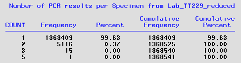

At the time this data check was run there were 1,396,291 unique values of LabSpecimenID (LSI). There were 24 LSI that had 3 or more records, i.e. PCR results. Here is the list:

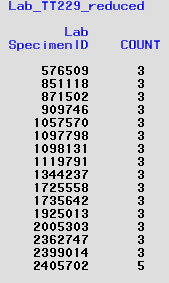

Since none of the PCR results for these LSI's have sequence results, i.e. they are not found on Lab_TT437, they were deleted in the cleaned dataset.

For the 5000+ duplicate records, i.e. LSI with two PCR tests, the observations were grouped by the number of key variables containing identical values. The key variables evaluated were `LabSpecimenID`, `ResultID`, `ResultDate`, and `CreateDate`. Here is that distribution:

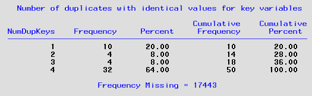

**Number of Dup Keys = 4:** Over 95% of duplicates were identical on all four key variables. In these cases the first record was kept.

**Number of Dup Keys = 3:** There were 10 duplicate LSI which had identical values for `LabSpecimenID`, `ResultID`, `ResultDate` but had different values for `CreateDate`. Here are the records:


It can be seen that seven of them have a `CreateDate` that differs by a single day. The others differ by months. Since the duplicates have the same result, the record with the earliest `CreateDate` was kept and the other one dropped.

**Number of Dup Keys = 2:** There were many more LSI with duplicate records that only had identical values for  `LabSpecimenID`, `ResultID` but different `ResultDate` and  `CreateDate`. In many cases they had the same `CreatedID` value, i.e. the record was created by the same person. Here are some of the records with two different values for `ResultDate`:


These records were de-duplicated as above, i.e. keep record with latest result date and earliest create date. The other group of duplicates that differed on `ResultDate` were in cases where the `ResultDate = .` Here are some example records:


These records were deduplicated by deleting the record where `ResultDate = .`.

**Number of Dup Keys = 1:** The final group of duplicates were those that only had one key variable with identical results. These records had different results for the same LSI. As with the previous group of duplicates, some of these had one record with a missing result and the other record had a result. In these cases the record with the missing result was deleted. 

The others had two different results, e.g. `ResultText = Positive` for one record and for the duplicate record (on LSI) `ResultText = Negative`. Here are some examples:


For these duplicates, the record with the lowest value of ResultID was kept, e.g. `ResultID=1` was kept and `ResultID=2` was deleted. 

**3. Check Lab_TT434_read**

This program conducts data checks on selected variables in Lab_TT434_read dataset. This datsaset has the results for "Other Molecular Assays" run on specimens collected. The full list of variables and their attributes for the Lab_TT434_read dataset are listed [HERE](./contents/PROC_Contents.Lab_TT434_read.pdf).

````diff
+/*------------------------------------------------------------------------------*
+| Check Lab_TT229_read data for:
+| 1. Compare "CreateBY" and "CreatedBY" variables
+| 2. Evaluate "ResultID" and "ResultText" variables
+| 3. Examine records with duplicate LabSpecimenID's
+|    a) Records with duplicate LabSpecimenID that have > 2 LabTest results 
+|    b) Records with duplicate LabSpecimenID that have 2 LabTest results
+| 4. Evaluate date variables
+*------------------------------------------------------------------------------*/

````

Some of the findings from this program include:

````diff
For check 1:
+| CreateBYID has no missing responses
+| CreateDbyID only has 700 responses, most are missing.
+| ** DO NOT USE CreateDbyID. DROP this variable.

For check 2:
+| ResultID is the numeric code assigned to ResultText. 
+| ResultText holds the description of the results for "Other Molecular Assays".
 |    ResultID = 1 for ResultText = 'Positive'
 |    ResultID = 2 for ResultText = 'Negative'
 |    ResultID = 4 for ResultText = 'Indeterminate'
 |    ResultID = 9 for ResultText = 'Unknown'
+| n=28 records are missing ResultID and ResultText
+| QuantitativeResult variable is nearly useless given wide range of responses.

Check 3 - see below

For check 4:
+| CreateDate has no missing values. 
+| UpdateDate exists for approx 0.8% of PCR results.
+| Result date is missing for approx 2.0% of PCR results.  
+| All date values are from much earlier time period than COVID, e.g. 1982.
+| ResultDate has values several months into the future, e.g. week 48, 2021
+| CreateDate goes from 2020 to present. 
+| UpdateDate goes from 2020 to present. 

````

Check 3 is to examine records with multiple LabSpecimenID's. The following table shows the frequency distribution of the number of records per LSI, i.e. Other Molecular Assays per specimen.

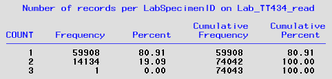

At the time this data check was run there were 74,043 unique values of LabSpecimenID (LSI). There was 1 LSI (`LabSpecimenID=937046`) that had 3 records, i.e. OMA results. Since there are no sequence results for this LSI, i.e. they are not found on Lab_TT437, the three records were deleted in the cleaned dataset.

For the 5000+ duplicate records, i.e. LSI with two Other Molecular Assays, the observations were grouped by the number of key variables containing identical values. The key variables evaluated were `LabSpecimenID`, `ResultID`, `ResultDate`, and `CreateDate`. Here is that distribution:

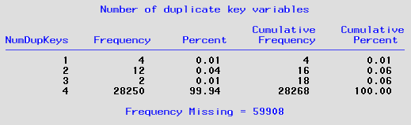

**Number of Dup Keys = 4:** Over 99% of duplicates were identical on all four key variables. In these cases the first record was kept and the other records were deleted in the cleaned dataset.

**Number of Dup Keys = 3:** There were 2 duplicate LSI which had identical values for `LabSpecimenID`, `ResultID`, `ResultDate` but had different values for `CreateDate`. Here are the records:

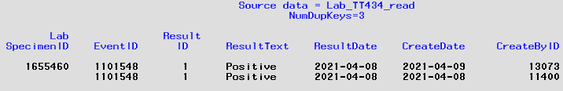

The duplicate records had a `CreateDate` that differs by a single day. Since the duplicates have the same result, the record with the earliest `CreateDate` was kept and the other one dropped.

**Number of Dup Keys = 2:** There were six LSI with duplicate records that had identical values for  `LabSpecimenID` and `ResultID` but different `ResultDate`. Four had identical values for  `CreateDate` and `CreateByID`. 

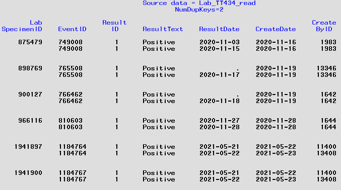

The duplicate records where `ResultID = missing` were deleted. For the others, the first record was kept (with the earliest result date) and the other record dropped. 

**Number of Dup Keys = 1:** There were two duplicate specimens that had different reults but the same CreateDate. The result date was missing. The record where `ResultID = missing` was dropped.

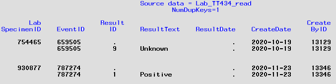


**3. Check.Lab_TT436_read.sas**

This program conducts data checks on selected variables in Lab_TT436_read. This dataset contains results for Test Type = "Variant of Concern". The full list of variables and their attributes for the Lab_TT436_read dataset are listed [HERE](./contents/PROC_Contents.Lab_TT436_read.pdf).

````diff
+/*--------------------------------------------------------------------*
+| Check Lab_TT436_read data for:
+|  1. Compare "CreateBY" and "CreatedBY" variables
+|  2. Evaluate "CreateByID" and "CreateBy" variables
+|  3. Evaluate "ResultID" and "ResultText" variables
+|  4. Explore relationship between LabID and LabSpecimenID
+|  5. Examine records with duplicate LabSpecimenID's
+|     a) Records with duplicate LabSpecimenID that have 3 or 4 LabTest results
+|     b) Records with duplicate LabSpecimenID that have 2 LabTest results
+|  6. Evaluate date variables
+|  7. Explore relationship between CreateDate and ResultDate
+*--------------------------------------------------------------------*/

````
Some of the findings from this program include:

````diff
For check 1:
+| "CreatedID" is the numeric c
+| CreateBYID has no missing responses
+| CreateDbyID only has 500 responses, most are missing.
+| ** DO NOT USE CreateDbyID

For check 2:
+| CreateByID is the numeric code assigned to names
+| CreateBy holds the names. Same connection as TestTypeID=437.
+| Almost 90% of VOC results were created by 8 people
+| n=26 different individuals have created lab tests results, including "System Admin" (ID=9999)

For check 3:
+| ResultID is the numeric code assigned to ResultText. In all but one case it is a 4 digit code.
+| ResultText holds the description of the sequencing result.
 |    ResultID = 1071 is for ResultText = 'Yes'
 |    ResultID = 1072 is for ResultText = 'No'
 |    ResultID = 9 is for ResultText = 'Unknown' 
+| ++n=1 record has a missing Result. LabSpecimenID=2162300 and EventID=1232059 with CreateDate=2021-08-06++

For check 4:
+| Records with duplicate LabSpecimenID have same EventID but different, unique LabID's
+| In other words, a LabSpecimenID can have multiple LabID's.

Check 5 - see below

For check 6:
+| CreateDate has no missing values. 
+| ResultDate is missing almost 40% of results. These dates shouldn't be missing. 
+| UpdateDate exists for less than 2% of results, which is fine.

For check 7:
+| CreateDate values begin week 3 of 2021 to the present. 
+| ResultDate values begin week 6 of 2020 to the present. 
+| No records have a ResultDate after CreateDate.
````

Check 5 is to examine records with multiple LabSpecimenID's. The following table shows the frequency distribution of the number of records per LSI, i.e. multiple lab results of "Variant of Concern" (VOC) per specimen.

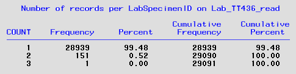

At the time this data check was run there were 29,091 unique values of LabSpecimenID (LSI). There was 1 specimen (`LabSpecimenID=1772736`) that had 3 records, i.e. sequence results for "VOC".

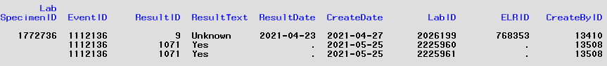

The first record with `ResultID = 9` was deleted. The remaining two records were de-duplicated keeping the first record. Finally, the missing result date was filled based on record with missing result.

For the 150+ duplicate records, i.e. LSI with two VOC results, the observations were grouped by the number of key variables containing identical values. The key variables evaluated were `LabSpecimenID`, `ResultID`, `ResultDate`, and `CreateDate`. Here is that distribution:

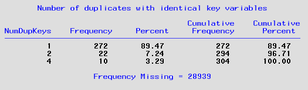

**Number of Dup Keys = 4:** There were 5 duplicate LSI which had identical results for all four key variables. In these cases the first record was kept and the other records were deleted in the cleaned dataset.

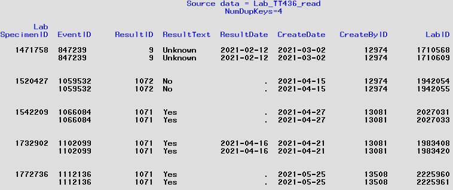)

**Number of Dup Keys = 3:** There were 11 duplicate LSI which had identical values for `LabSpecimenID`, `ResultID`, `ResultDate` but had different values for `CreateDate`. Here are the records:

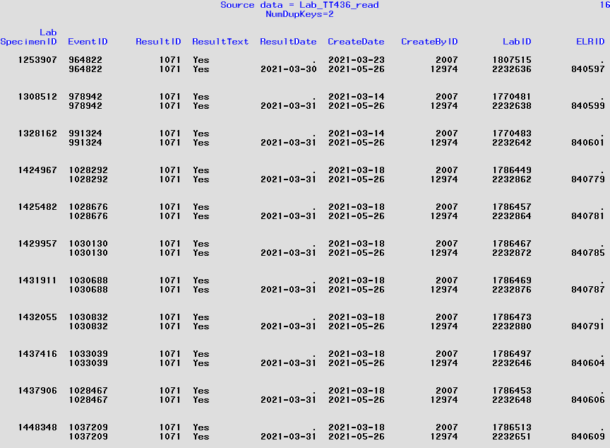

All 11 duplicate records had a `ResultDate = missing` for `CreateDate in 2021-03-xx` and `ELRID=missing`.  The record with the missing result date was deleted.

**Number of Dup Keys = 1:** There were over a hundred duplicate specimens that had different reults and were different on other key variables. All but four of these had an initial `ResultID = 9` (Result is 'Unknown'). These records were deleted in the cleaned dataset. For the four duplicates (that didn't have an unknown result) - the initial record had `ResultDate = missing` and `ResultID=1071` (Result is 'Yes'). The second record had a result date and `ResultID=1072` (Result is 'No'). The first record was dropped.

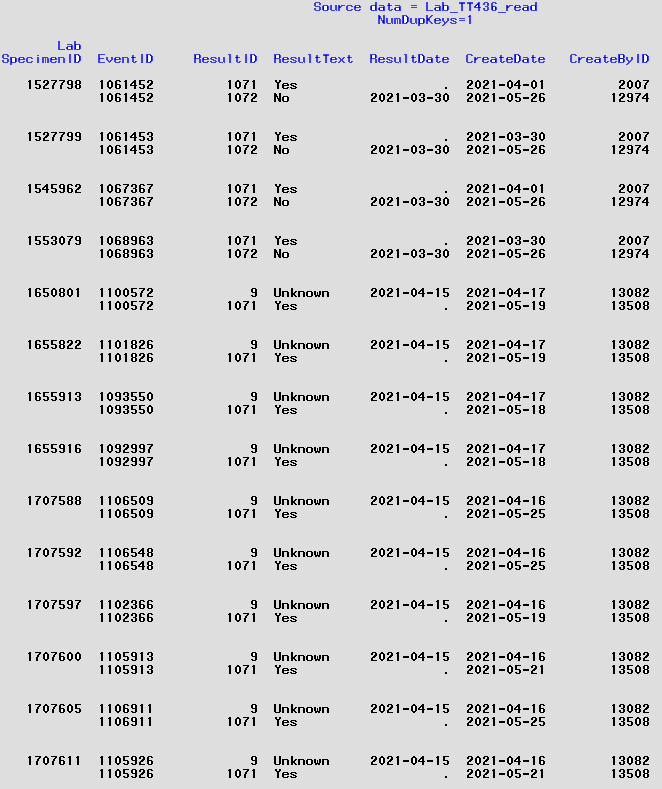

**3. Check.Lab_TT437_read.sas**

This program conducts data checks on selected variables in Lab_TT436_read. This dataset contains results for Test Type = "Variant of Concern". The full list of variables and their attributes for the Lab_TT436_read dataset are listed [HERE](./contents/PROC_Contents.Lab_TT437_read.pdf).

````diff
+/*--------------------------------------------------------------------------------*
+| Check Lab_TT437_read data for:
+|  1. Compare "CreateBY" and "CreatedBY" variables
+|  2. Evaluate "CreateByID" and "CreateBy" variables
+|  3. Evaluate "UpdatedBy" variables
+|  4. Evaluate "TestBrandID" and "TestBrand" variables
+|  5. Explore relationship between LabID and LabSpecimenID
+|  6. Examine records with duplicate LabSpecimenID's
+|     a) Records with duplicate LabSpecimenID that have 3 or 4 LabTest results
+|     b) Records with duplicate LabSpecimenID that have 2 LabTest results
+|  7. Evaluate "ResultID" and "ResultText" variables
+|  8. Evaluate "ELRID" variable
+|  9. Evaluate date variables
+| 10. Explore relationship between CreateDate and ResultDate
+| 11. Check for results = "Specimen unsatisfactory for evaluation"
+*----------------------------------------------------------------------------------*/
````
Some of the findings from this program include:


````diff
For check 1:
+| CreateBYID has no missing responses
+| CreateDbyID only has 500 responses, most are missing.
+| ** DO NOT USE CreateDbyID

For check 2:
+| CreateByID is the numeric code assigned to names
+| CreateBy holds the names.
+| Almost 90% of COVID lab test results were created by 7 people
+| n=25 different individuals have created lab tests results, including "System Admin" (ID=9999)

For check 3:
+| UpdatedBy holds the names of individuals that updated lab results.
+| UpdatedBy does NOT match (or align with) CreateByID.

For check 4:
+| All values of these variables are missing.
+| DROP these three variables (TestBrandID, TestBrand, LegacyTestID).

For check 5:
+| Records with duplicate LabSpecimenID have same EventID but different, unique LabID's
+| In other words, a LabSpecimenID can have multiple LabID's.

Check 6 - see below

For check 7:
+| ResultID is the numeric code assigned to ResultText. In all but one case it is a 4 digit code.
+| ResultText holds the description of the sequencing result.
 |    ResultID=9 for ResultText = 'Unknown'
 |    ResultID=1061 is for ResultText = 'B.1.1.7 - for surveillance only...'
 |    ResultID=1062 is for ResultText = 'B.1.1.7 - like...'
 |    ResultID=1067 is for ResultText = 'Sequence inconclusive'
 |    ResultID=1068 is for ResultText = 'Unassigned variant'
 |    ResultID=1069 is for ResultText = 'Other'
 |    ResultID=1070 is for ResultText = 'Specimen unsatisfactory for evaluation'
 |    ResultID=1081 is for ResultText = 'B.1.617.2 - for surveillance only...'
 |    ResultID=1082 is for ResultText = 'B.1.617.2 - like...'
 |    Result ID's go from 1061 - 1089.
+| Several results of the same variant type have different result text, i.e. "-like". 

For check 8:
+| Almost a third of records are missing ELRID value
+| Otherwise, ELRID is a 6 or 7 digit ID unique for each record.

For check 9:
+| CreateDate has no missing values. 
+| ResultDate is missing in more than 25% of results. These dates shouldn't be missing. 
+| UpdateDate exists in about 3% of results, which is fine.

For check 10:
+| CreateDate values begin week 3 of 2021 to the present. 
+| ResultDate values begin week 6 of 2020 to the present. 
+| No records have a ResultDate after CreateDate.

For check 11:
+| n=3755 results where "Specimen unsatisfactory for evaluation"
+|FIX:  Delete these records

````

For check 7, the edit program will re-format results to combine result text pairs into a single variant type.

For check 11, records where `ResultText="Specimen unsatisfactory for evaluation"` will be deleted in the cleaned dataset.

Check 6 is to examine records with multiple LabSpecimenID's. The following table shows the frequency distribution of the number of records per LSI, i.e. multiple lab results of "Variant type" per specimen.

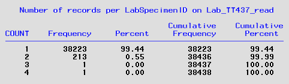

At the time this data check was run there were 38,438 unique values of LabSpecimenID (LSI). There was 1 specimen (`LabSpecimenID=1772736`) that had 3 records and another that had 4 records (`LabSpecimenID=1772736`).

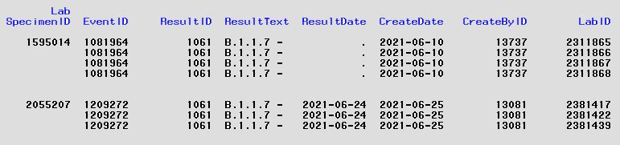

These two specimens had duplicate results, result dates, create dates, and CreateByID. These records were de-duplicated by keeping the first record only. 

For the 200+ duplicate records, i.e. LSI with two results for variant type, the observations were grouped by the number of key variables containing identical values. The key variables evaluated were `LabSpecimenID`, `ResultID`, `ResultDate`, and `CreateDate`. Here is that distribution:

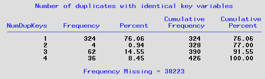

**Number of Dup Keys = 4:** 
There were 18 duplicate LSI which had identical results for all four key variables. They all also had the same CreateDate. In these cases the first record was kept and the other records were deleted in the cleaned dataset.

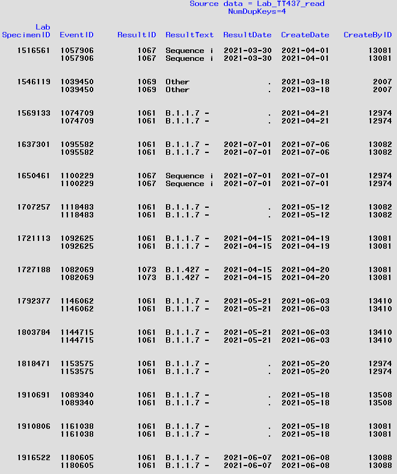

**Number of Dup Keys = 3:** There were 31 duplicate LSI which had identical values for `LabSpecimenID`, `ResultID`, `ResultDate` but had different values for `CreateDate`. Here are the records:

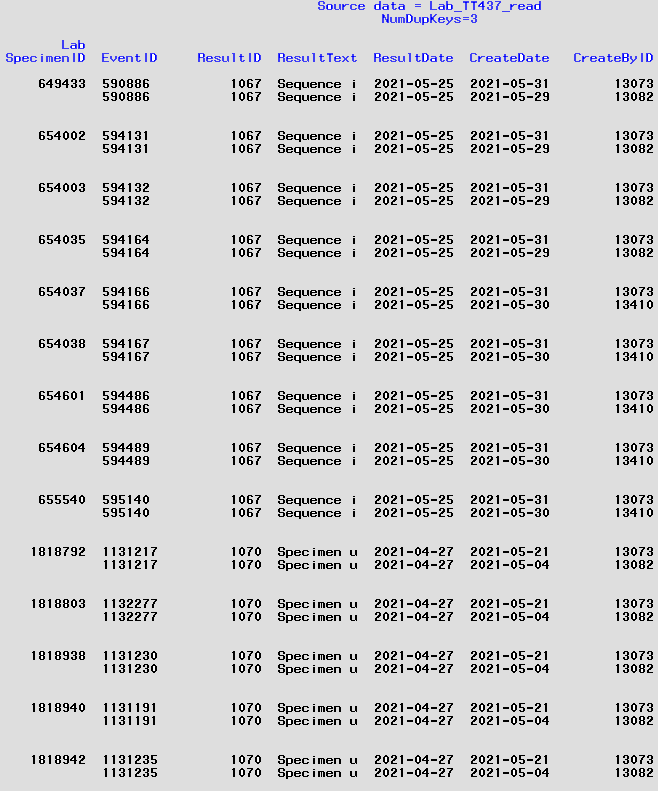

All but two of the duplicate records had a `ResultID in (1067, 1070)` and in all but three the CreateDate was in May 2021. The Result text for these two is "Sequence inconclusive" and "Specimen unsatisfactory for evaluation" respectively. In either case the result is irrelevant and so the records were de-duplicated by keeping the first record.

**Number of Dup Keys = 2:** There were two specimens with duplicate variant type results. They had identical values for  `LabSpecimenID` and `ResultID` but the first record had  `ResultDate = missing`. Didn't keep the orginal create date though. 

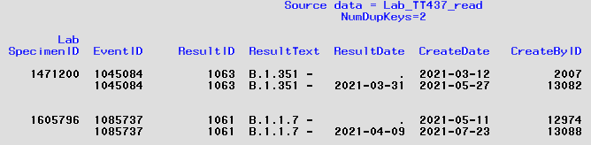

**Number of Dup Keys = 1:** There were over 150 duplicate specimens that had different reults on variant type and were different on other key variables. All but two of these had an initial `ResultID in (1069 or 1070)` which corresponds to sequence type of "Other" or "Specimen unsatisfactory" respectively. The initial records also had `ResultDate=missing`. For these cases, the first record was deleted in the cleaned dataset. 

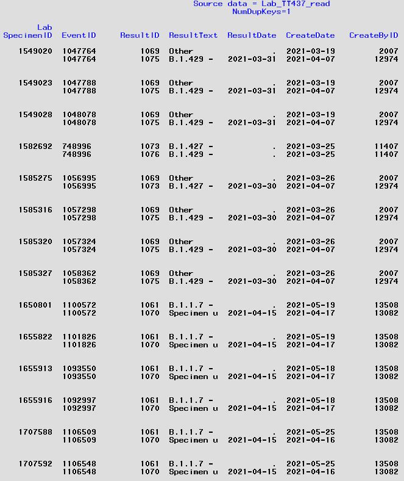

###
## Data editing:

No data edits were needed for the Specimens_read dataset. Edits to the data in the other four curated datasets were made using a separate "Fix.*.sas" program for each. The programs keep the two key variables - `LabSpecimenID` and `EventID`. The test-level variables are kept and renamed by adding extension for specific test type, e.g. _TT229.
            
 * [Fix.Lab_TT229.sas](../Fix.LabTests_TT229.sas) - links to the full program; the list of edits made are below.
````diff  
+/*---------------------------------------------------------------------------------------------------------------*
+Fixes made in this code:
+|1. De-duplicate records with two LabTest results per Specimen that have identical values in FOUR variables
+|2. De-duplicate records with two LabTest results per Specimen that have identical values in THREE variables
+|3. De-duplicate records with two LabTest results per Specimen that have identical values in TWO variables
+    AND ResultDate = missing.
+|4. De-duplicate records with two LabTest results per Specimen that have identical values in TWO variables
+|    AND ResultDate ^= missing.
+|5. De-duplicate records with two LabTest results per Specimen that have identical values in ONE variable
+|    AND ResultDate = missing.
+|6. De-duplicate records with two LabTest results per Specimen that have identical values in ONE variable
+|    AND ResultDate ^= missing.
+|7. a) DROP extraneous variables (TestBrandID  TestBrand  LegacyTestID  CreatedByID)
+|7. b) Delete duplicate records that are irrelevant, i.e. NO sequence results 
+|7. c) RENAME variables to keep when merging 
+|7. d) DROP variables not needed for merging 
+|8. SORT fixed data for merging
+|9. Contents of new dataset with edits
+*---------------------------------------------------------------------------------------------------------------*/
````
##
 * [Fix.Lab_TT434.sas](../Fix.LabTests_TT434.sas)   - links to the full program; the list of edits made are below.     
  
````diff
+/*---------------------------------------------------------------------------------------------------------------*
+| Fixes made in this code:
+| 1. De-dup records with two Test results per Specimen with identical values in FOUR variables
+| 2. De-duplicate records with two LabTest results per Specimen that have identical values in THREE variables
+| 3. De-duplicate records with two LabTest results per Specimen that have identical values in TWO variables  AND ResultDate = missing.
+| 3. DROP extraneous variables (TestBrandID  TestBrand  LegacyTestID  CreatedByID)
+| 4. De-duplicate records with two LabTest results per Specimen that have identical values in TWO variables  AND ResultDate ^= missing.
+| 5. a) De-duplicate records with two LabTest results per Specimen that have identical values in ONE variable  AND ResultID = missing.
+| 5. b) RENAME variables to keep when merging with Lab_TT437_fix
+| 5. c) DROP variables not needed for merging with Lab_TT437_fix
+| 6. SORT fixed data for merging
+| 7. Contents of new dataset with edits
+*---------------------------------------------------------------------------------------------------------------*/
````
##
 * [Fix.Lab_TT436.sas](../Fix.LabTests_TT436.sas)  - links to the full program; the list of edits made are below.

````diff
+/*---------------------------------------------------------------------------------------------*
+| Fixes made in this code:
+| 1. DROP extraneous variables (TestBrandID  TestBrand  LegacyTestID  CreatedByID)
+| 2. Delete one obs of triplicate record where ResultID = 9
+| 3. Delete duplicate records that are irrelevant, i.e. NO sequence results
+| 4. De-dup records with two Test results per Specimen with identical values in FOUR variables
+| 5. De-dup records with two Test results per Specimen with identical values in TWO variables
+| 6. For duplicate records with identical values in ONE variable, delete record where result='No'
+| 7. RENAME variables to keep when merging with Lab_TT437_fix
+| 8. DROP variables not needed for merging with Lab_TT437_fix
+| 9. SORT fixed data for merging
+*---------------------------------------------------------------------------------------------*/
````

##
 * [Fix.Lab_TT437.sas](../Fix.LabTests_TT437.sas)  - links to the full program; the list of edits made are below.
````diff
+/*------------------------------------------------------------------------------------------------*
+| Fixes made in this code:
+| 1. De-dup records with two Test results per Specimen with identical values in FOUR variables
+| 2. De-dup records with two Test results per Specimen with identical values in THREE variables 
+| 3. Delete duplicate record where ResultDate = missing (dups with identical values in TWO vars)
+| 4. Delete duplicate records with different values for all variables (except LabSpecimenID)
+| 5. Delete results = "Specimen unsatisfactory for evaluation"
+| 6. Re-format ResultText field: i.e. extract lineage name and ignore descriptive text
+| 7. RENAME variables to keep when merging with Lab_TT437_fix
+| 8. DROP variables not needed for merging with Lab_TT437_fix
+| 9. SORT fixed data for merging
+*------------------------------------------------------------------------------------------------*/
````

###
#### Cleaned data tables:
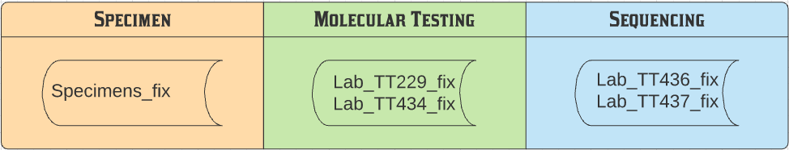

##
## Data merging:

The PROC contents for the five cleaned datasets can be found via the links below:
1. [Specimens_read](./contents/PROC_Contents.Specimens_read.pdf)
2. [Lab_TT229_fix](./contents/PROC_Contents.Lab_TT229_fix.pdf)
3. [Lab_TT434_fix](contents/PROC_Contents.Lab_TT434_fix.pdf)
4. [Lab_TT436_fix](contents/PROC_Contents.Lab_TT436_fix.pdf)
5. [Lab_TT437_fix](contents/PROC_Contents.Lab_TT437_fix.pdf)

The PCR-level results data (Lab_TT229_fix) is merged with the Specimen-level data by LabSpecimenID. Only records on Lab_TT229_fix are kept in the new dataset: Specimens_w_PCR.

**Check.Lab_TT436_read.sas**
This program conducts data checks on selected variables in Specimens_w_PCR dataset. This datsaset has the collection date and specimen data for ALL RT-PCR tests. The full list of variables and their attributes for the ??????

````diff
+toc
````


##
### Data flow for merging the cleaned data together.

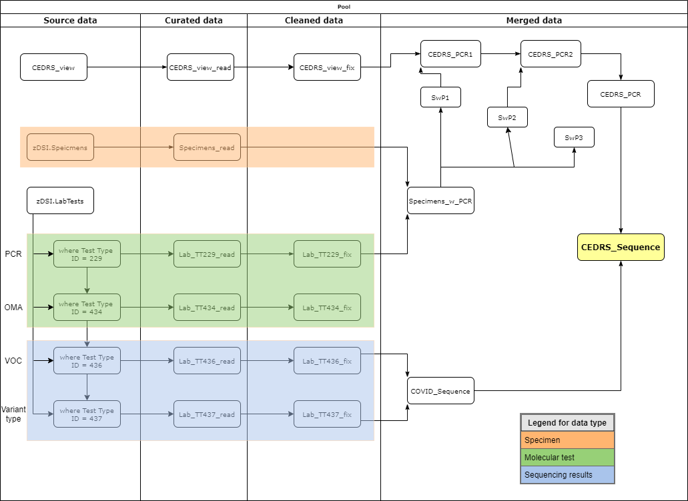


```
 What does this look like?
```
  *does*
  **does**
  **_does_**


```
 It looks like the end :(
```
