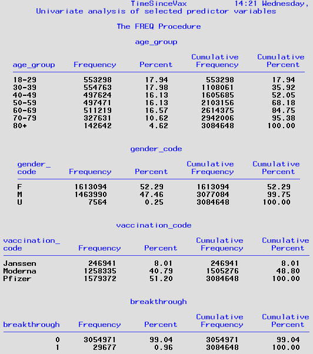
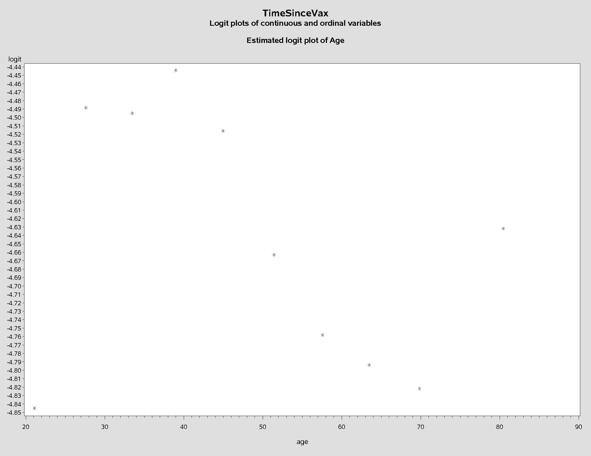
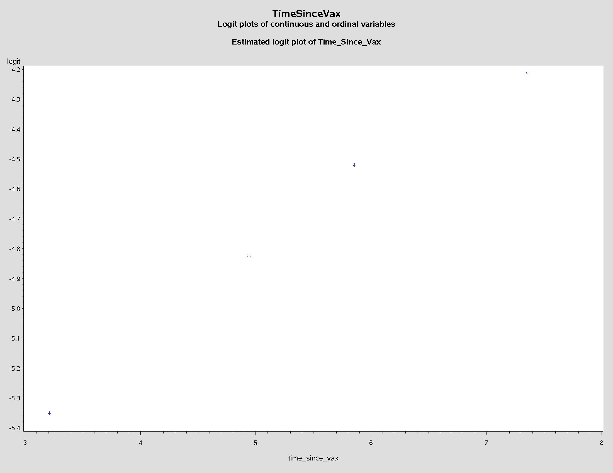
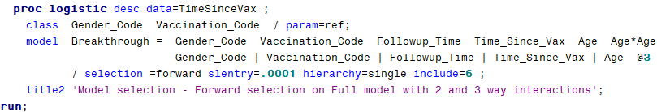
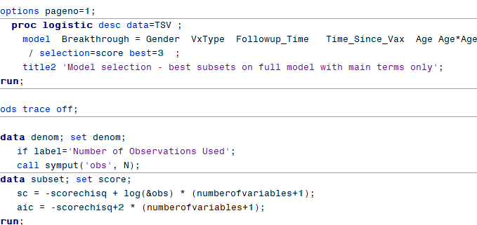
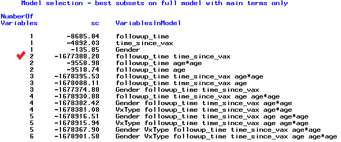
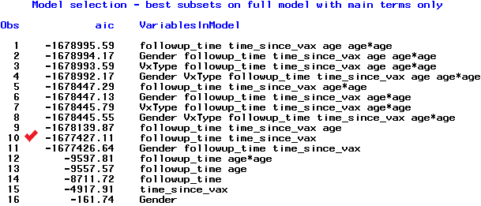
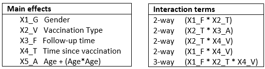

## Background 
This data request on waning immunity came from Rachel S. There is email discussion between her and Debashis Ghosh. The outcome variable is breakthrough cases.


**Population**:  Confirmed and probable cases in CEDRS for 12/14/20 through 9/23/21. **Independent variables**: Time since vaccination and also age, gender, vaccine recieved. **Data requested**: Build a logistic regression model on outcome (Breakthrough case) by time since vaccination. 

Source:  [Categorical Data Analysis using Logistic Regression](images/Cover_page.jpg)

## 
## Code
Rachel S. had a dataset on dphe144 server named `timesincevax_regression_data`. The SAS program [Access.TimeSinceVax.sas](./Access.TimeSinceVax.sas) was used to read and curate this data table and create the SAS dataset `TimeSinceVax`. The SAS program [RFI.LR_on_Time_Since_Vax.sas](./RFI.LR_on_Time_since_Vax.sas) builds the logistic regression model. The contents of this dataset can be found [here](./Proc%20Contents_TimeSinceVax.pdf).
#
Step 1: Variable reduction. Not needed in this case since variables pre-selected.

**Step 2: Univariate analysis.**
######
**__________________________** 

**Result of univariate analysis of variables with discrete values:**


##
**Step 3: Logit plots of continuous variables.**
**__________________________________________** 

Assumption is that there is a linear relationship between continuous (or ordinal) independent variables and the logit of the outcome variable. These plots check that assumption.

**Logit plot of Age:**


**Logit plot of Follow-up Time:**


**Logit plot of Time since vaccination:**


Findings:
````diff
+/*----------------------------------------------------------------------+-----------------*
+| 1. Age_Group should be put on the CLASS statment since it is non-linear in logit
+|    So it will NOT be treated as an ordinal variable.
+| 2. Follow-up time is linear in logit so it goes in the model as a continuous variable.
+| 3. Time since vaccination is linear in logit so it goes in model as a continuous variable.
+| 4. Age is NOT linear in the logit; several transformations were tested.
+|    Age squared resulted in the lowest AIC.
+*---------------------------------------------------------------------------------------*/
````
##
**Step 4: Use forward selection to find significant interaction terms.**
**____________________________________________________________**  

Here is the code:



Here are the findings:

````diff
+/*--------------------------------------------------------------*
+|FINDINGS: Four 2-way interaction terms are significant:
+| 1. Followup_Time  *  Time_Since_Vax
+| 2. Time_Since_Vax  *  Age
+| 3. Time_Since_Vax  *  Vaccination_Code
+| 4. Followup_Time  *  Vaccination_Code
+| AND one 3-way interaction term was significant:
+| 5. Followup_Time  *  Time_Since_Vax  *  Vaccination_Code
+*--------------------------------------------------------------*/
````

##
**Step 5: Model building using Best Subsets selection.**  
**_________________________________________________** 

Here is the code:



Here are the subsets by SC score:


And by AIC score:


Here are the findings:
````diff
+/*----------------------------------------------------------------------------*
+ |FINDINGS:
+ | Best subsets on full model shows 3 models for each model size (# of vars)
+ | SC scores drop sharpy starting with a 2 var model. 
+ | AIC for best subset models had 11 models with extremely low scores.
+ | Best model per SC and AIC is VB = Follow-up + Time_Since_Vax
+ *----------------------------------------------------------------------------*/
````

##
**Step 6: Comparison of competing models.**
**_____________________________________**   

I wanted to compare this best model with other models. Specifically the full model, with and without significant interaction terms. A competing model with Age variable added in, with and without associated interaction term. And then the best model with the associated interaction term added.

| |Model name|DF|AIC|Model|
|-|----------|--|---|-----|
|1|[Full model without interaction terms](Full_model_mains_only.pdf)|8|9549|VB = x1_G + x2_V + x3_F + x4_T + x5_A|
|2|[Full model with interaction terms](Full_model_w_interactions.pdf)|16|6460|VB = x1_G + x2_V + x3_F + x4_T + x5_A + (interactions)|
|3|[Competing model without interactions](Competing_model_NO_interactions.pdf)|4|9680|VB = x3_F + x4_T + x5_A|
|4|[Competing model with 2 interaction terms](Competing_model_2_interactions.pdf)|6|6617|VB = x3_F + x4_T + x5_A + (x3_F * x4_T) + (x4T * x5_A)|
|5|[Best model without interaction term](Best_model_NO_interactions.pdf)|2|9888|VB = X3_F + X4_T|
|6|[Best model with 1 interaction term](Best_model_1_interaction_term.pdf)|3|6777|VB = X3_F + X4_T + (x3_F * x4_T)|



##
**Step 7: Assessment of final model**
**_______________________________** 

The SAS output for predictive power and goodness-of-it can be found [here](Final_Model_Goodness_of_Fit.pdf)

Here are the findings:
````diff
+/*-----------------------------------------------------------------------------------*
+ |FINDINGS:
+ | The number of distanct obs is 12,972.
+ | The p-value for Deviance and Pearson chi-sq differ so there may be a data issue.
+ | (want these values to be large - Deviance is but Pearson is small)
+ | Re: predictive power of the model:
+ |    a) Generalized R2 = 
+ |    b) Max-rescaled R2 = 0.9808 (out of 1)
+ | Re: goodness of fit, the Hosmer-Lemeshow Goodness-of-Fit test is significant.
+ |    This means there is evidence of lack of fit. 
+ |    BUT could this be from large sample size??
+ |    OR is this because three of the expected cells are <5??
+ *-----------------------------------------------------------------------------------*/
````


##
**Issues:**
* Need access to or input from a biostatistician. 
* Should split the dataset and build model on half and then do prediction on other half.

